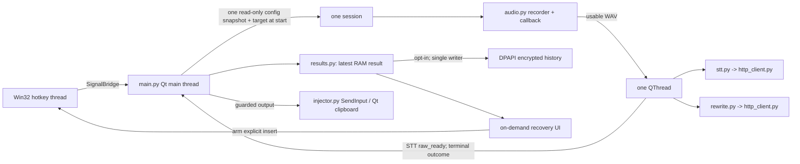

# Implementation Plan: Dictation Roadmap

This plan tracks the eight active items in [FEATURES.md](FEATURES.md), in its priority order. It is a roadmap, not a description of shipped behavior; [IMPLEMENTATION.md](IMPLEMENTATION.md) remains the reference for current contracts. Work on the numbered sections as separate, verifiable increments rather than one cross-cutting rewrite. Snippets, analytics, an enforced local-only policy, selected-text editing, and other excluded work are not planned here. This file is the roadmap and acceptance overview; the linked feature pages below contain the canonical detailed designs (diagrams, types, function boundaries, invariants, concurrency, migration and test cases). Do not implement from the abbreviated sections alone.

## Progress (2026-09-30)

- **P0 / 1, code implemented:** `AppConfig.stt_language_favorites` persists as an ordered JSON array with normalization, validation and safe malformed-list fallback; old active INI/`.env` languages remain selectable. Settings offers an active-language selector and favorite add/edit/remove with Apply/OK/Cancel semantics. The tray Language radio submenu always includes Auto, Czech and English plus favorites/old active codes, saves a selection immediately, and restores the live and visible selection on save failure. A recording-start config snapshot isolates primary/fallback STT, rewrite and post-type key from later tray edits. Settings locks config-mutating tray controls during its nested event loop while keeping Enabled and Exit available. The full Linux suite passed (175 tests, 4 Windows-only skips), as did compileall, import, Ruff check/format and `git diff --check`.
- **P0 manual gate still open:** on a packaged Windows build, switch Auto/Czech/English and a favorite in the real tray during a long recording and during processing; check current versus next STT/fallback and rewrite requests, Settings Apply/Cancel and restart persistence. Automated Linux tests do not establish actual tray, provider-language quality or Windows hotkey behavior. Do not mark the P0 acceptance gate fully verified until this check is recorded.
- **P1 / 5, code implemented:** coherent callback RMS/data/status snapshots and opened-device identity; a recording-scoped 100 ms meter/label; capture failure distinct from quiet; no explicit-device fallback, conflict or substring guessing; shared Settings selection policy, explicit Refresh and fresh calibration identity checks. The final Linux suite passed (197 tests, 4 Windows-only skips), along with compileall, import, Ruff check/format and `git diff --check`. Independent review identified a long-device-name status elision issue; it was corrected and covered by a regression test. Current contracts are in [IMPLEMENTATION.md](IMPLEMENTATION.md).
- **P1 / 5 manual gate still open:** a packaged Windows build and real speech/pause, USB unplug/replug, default-device changes, sleep/resume, Settings refresh and calibration checks are not established by Linux tests. See the [hardware checklist](implementation-plan/05-microphone.md#windows-manual-gate). Do not mark microphone recovery fully verified until those results are recorded.
- **P1 / 2-4 and P2/P3 / 6-8:** not started by this increment. The Windows Notepad diagnosis and their feature-specific acceptance gates remain outstanding. Feature 5 was independent of the result/recovery prerequisites and Windows-only diagnosis.

## Detailed Feature Plans

| Order | Technical plan | Primary implementation gate |
| --- | --- | --- |
| P0 / 1 | [Tray language and session snapshot](implementation-plan/01-language.md) | Apply/Cancel, old INI, frozen STT/fallback/rewrite requests |
| P1 / 2 | [Insertion, clipboard and focus](implementation-plan/02-output.md) | Reproduce Notepad before claiming a fix; recovery exists before withholding |
| P1 / 3 | [Result lifecycle, retry and encrypted history](implementation-plan/03-recovery.md) | Raw checkpoint before output; one instance before disk history |
| P1 / 4 | [Rewrite fidelity, literal examples and diff](implementation-plan/04-rewrite.md) | Preserve saved prompts; manual model evaluation, not mocked quality claims |
| P1 / 5 | [Microphone, meter and device failures](implementation-plan/05-microphone.md) | Real Windows unplug/replug and sleep/resume checks |
| P2 / 6 | [Vocabulary and per-provider STT prompting](implementation-plan/06-vocabulary.md) | No new multipart field without provider-specific opt-in |
| P2 / 7 | [Rewrite profiles and app matching](implementation-plan/07-profiles.md) | Persisted prompt migration and capture app identity at start |
| P3 / 8 | [Keyless/local STT](implementation-plan/08-local-stt.md) | Verify a version-pinned local server and offline Windows dictation |

### Review of This Roadmap

The accepted scope and priority are coherent, but several implementation details were not determined by the overview alone:

- The worker's current terminal success discards raw STT, and an injection exception discards even final text. A `raw_ready` checkpoint and result ownership on the Qt thread must ship before guarded output can withhold text. `QThread.finished` and the terminal result are separate events; both must complete before a new task starts. See [3](implementation-plan/03-recovery.md).
- `SendInput` counts cannot prove visible insertion; even a full text batch followed by a failed/skipped post-key must retain the distinction. Match HWND **and PID**, not a window title or executable path, and report clipboard/text/post-key outcomes separately. Manual insert cannot happen safely by clicking a focused recovery dialog: arm the text, return focus to an external app, then use a separate global recovery shortcut. This copies the interaction pattern documented by [Wispr Flow's Windows help](https://docs.wisprflow.ai/articles/7971211038-fix-text-not-pasting-after-dictation), not its automatic retry or clipboard policy. See [2](implementation-plan/02-output.md).
- History cannot safely be read-modify-written by two running instances even if each replacement is atomic. There is no current single-instance guard in `main.py`; **one instance per user data directory** was selected for this plan. Add the process guard before reading/migrating settings or writing encrypted history; do not silently create a multi-writer synchronization protocol. See [3](implementation-plan/03-recovery.md).
- A successful fallback *LLM provider* is still a successful rewrite: `rewrite_status=succeeded`. A failed/empty rewrite falls back to raw with `LLM_FAILED`; no unsupported provider-identity field or `fell_back` status is inferred from the current `PipelineResult`. Disabled rewrite is `not_requested`. See [3](implementation-plan/03-recovery.md) and [4](implementation-plan/04-rewrite.md).
- `SettingsDialog.exec()` runs a nested Qt event loop; tray config actions can change live settings while a dialog draft is open. Disable config-mutating tray actions during Settings while leaving Enable/Exit usable, or Settings Apply could overwrite a newer selection. One main-owned session snapshot is built *before* audio start, profile resolution completes on that copy, and the worker thereafter reads it only. See [1](implementation-plan/01-language.md) and [7](implementation-plan/07-profiles.md).
- A saved prompt equal to an old built-in prompt still counts as saved: feature 4 uses **key presence** for pre-revision installs and persists a prompt-origin marker, so feature 7 can distinguish a new default saved after feature 4 from a saved legacy/custom prompt. Config collection codecs for favorites, vocabulary and profiles have different corruption policies: a damaged favorites list can default without discarding active language; a damaged vocabulary value survives unrelated saves until explicit repair; a damaged profile catalog must not be overwritten as empty. Validate record and collection formats at their owner boundary. See [1](implementation-plan/01-language.md), [4](implementation-plan/04-rewrite.md), [6](implementation-plan/06-vocabulary.md), [7](implementation-plan/07-profiles.md).
- Device ID/name resolution and Settings device selection must agree: existing first-name/substring/default fallback is incompatible with an explicitly selected microphone that disappeared. A live meter is evidence of samples, not intelligible dictation. See [5](implementation-plan/05-microphone.md).

### Shared Session Contract

The diagram describes the planned integrated state, not the current architecture. The **source of truth** for active preferences is the live `AppConfig` plus its atomic INI save; for one dictation it is the main-owned snapshot. For usable raw/final text during a running process it is the main-owned record; the history file contains only committed opt-in records. The worker has no mutable UI/history authority. The exact same session ID travels with `raw_ready` and terminal signals; output happens only after retaining the terminal result. A late cancellation prevents automatic clipboard and typing, not explicit later recovery. No path retries injection automatically, and no successful SendInput return establishes visible field contents. See the two P1 details for the delivery/recovery contract.

## Delivery Rules and Dependencies

- Keep the fast path hotkey -> record -> STT -> optional cleanup -> output. `main.py` owns session timing, Qt UI and worker signals; `audio.py`, `stt.py`, `rewrite.py` and `injector.py` stay Qt-free. Backend modules must not import one another. All modules remain importable off Windows; Windows-only runtime work stays guarded.
- At recording start, freeze a copy of the effective configuration for that dictation. The P0 language control now uses the main-owned snapshot rather than the mutable live `AppConfig`; future profile controls must use that same snapshot. Pending changes affect only the next recording. Existing hotkey restart-on-release logic remains intact.
- Distinguish four outcomes: audio acquired, raw text transcribed, rewrite completed or fell back, and input events submitted (not guaranteed displayed). Retain only the evidence each stage actually provides. Do not promise exactly-once delivery to arbitrary Windows controls; a partial `SendInput` call can already have inserted text.
- Delivery order: **1** ships alone as P0. **2** diagnoses the Notepad issue first, then adds guarded output; **3** supplies the shared recovery/result storage used by 2 and 4. **4** can revise the default prompt before 3, but its raw/clean inspection UI depends on 3. **5** is independent of 3/4. **6** builds on 4's prompt rules; **7** builds on 1's snapshot and 2's application identity; **8** is independent of profiles. Within P1, implement the small in-memory result/recovery slice of 3 before shipping 2's withheld/failed-insertion path: never withhold output without a way to retrieve it.
- Persist small preferences using the existing `AppConfig`/`QSettings` atomic INI path. Favorite languages now have an explicit JSON codec; future collections still need owner-specific validation. Use `SettingsDialog`'s deep-copy, Apply/OK, Cancel flow and main's reload/rebuild. Avoid a provider/plugin registry, new background service or queue.
- Update [IMPLEMENTATION.md](IMPLEMENTATION.md) when public signatures, persistence or guarantees actually change; update `README.md` when shipped user behavior changes. Keep these future decisions here until implemented.

### Verification Convention

For each increment, add focused `unittest` cases at the observable boundary and run them, then `python -m unittest discover -s tests -v`, `python -m compileall src/ tests/ .github/scripts/`, `python -c "import src; print('OK')"`, `ruff check src/ tests/ .github/scripts/` and `ruff format --check src/ tests/ .github/scripts/`. CI already runs the suite on Windows 3.11/3.12 and imports on Ubuntu (`.github/workflows/ci.yml`). A packaged Windows build and real desktop/hardware check are separate requirements for Win32, tray and microphone behavior; Linux mocks are not evidence that Notepad or a real device works.

## 1. Quick Language Switching in the Tray (P0)

**Baseline before P0.** `AppConfig.stt_language` was one string; the STT tab edited it as free text. `stt.py` gives the same language to primary and fallback, omitting the multipart field for `""` (auto), and `rewrite.py` appends the language hint. Tray radio choices and atomic INI saves existed, but no list codec or language menu existed. The code changes and outstanding manual gate are tracked above; the current contract is in [IMPLEMENTATION.md](IMPLEMENTATION.md).

**Implementation.**

1. Keep `stt_language` as the authoritative active code (`""` = auto). Add one persisted ordered list of favorite codes, with explicit JSON serialization and decoding in `config.py`; normalize and deduplicate on input, reject invalid entries in Settings, and fall back safely on a malformed persisted list without dropping a valid old `stt_language`. Auto, Czech (`cs`) and English (`en`) are always available in the tray even when no favorites exist; favorites add other provider-supported codes. Include an existing nonempty language in the displayed choices even if it came from an old INI or `.env` backfill (`main.py:117-124`) after loading. A missing list on an old install must not change the active language. Use a small built-in label mapping for known codes; show an unknown code as itself rather than maintaining a comprehensive language catalog.
2. In the STT tab, edit favorites and select the active language or Auto. Removing the currently selected additional favorite switches to Auto; the built-in Czech/English choices stay available. Persist both values together on Apply/OK, and make Cancel discard both. If a saved code is unknown, show it rather than deleting it. Avoid a new tab or profile dependency.
3. Add a `Language` radio submenu, with Auto and favorites, using the existing `_add_choice_submenu` pattern. Tray selection updates both live selection and persisted `stt_language`, and marks the selected item visibly; Settings reloads from disk after Apply. If saving fails, restore the prior live selection and report the error rather than falsely displaying a persisted value.
4. Freeze the per-dictation config at `_start_recording()` and supply it at `_finalize_recording()` to the worker; do not freeze only when the network call starts. A tray change while recording or processing must leave that session's primary/fallback STT and rewrite hint unchanged; a later dictation sees the new language. Reuse the same snapshot in later sections.

**Verification.** Extend `tests/test_config.py` for old INI migration, malformed/list round-trip and active-selection persistence; `tests/test_settings_dialog.py`/`test_settings_hotkey.py` for Apply/Cancel; `tests/test_tray_menu.py` for tray selection, saving and frozen sessions; `tests/test_stt_rewrite.py` for `cs`, `en`, and omitted auto hint in primary and fallback requests and rewrite. On Windows manually switch tray language during a long recording and check the current/next requests. Do not equate choosing a language with automatic within-utterance code switching.

**Choice/trade-off.** One active string plus a JSON favorites list preserves the existing STT contract; a new profile object just to hold a language would complicate P0. Explicit JSON needs a small codec but avoids Qt variant-list round-trip ambiguity. No local model or language auto-routing is introduced.

## 2. Reliable Insertion and Clipboard Output (P1)

**Current path.** `main.py:316-362` starts audio and worker without recording the intended target. `_on_worker_succeeded()` (`main.py:424-441`) types into the window active *at completion* and drops results when disabled, exiting or Settings is open. `injector.type_text()` (`injector.py:28-147`) batches UTF-16 `SendInput` events, checks returned count, then sends the optional post-key; even a partial batch may have inserted a prefix. `hotkey.py:143-201` tracks low-level events, not the obsolete `_watch_release` named in the old backlog diagnosis. `tests/test_injector.py` tests post-key and partial failure; `tests/test_tray_menu.py` protects against typing into Settings.

**Implementation.**

1. **Diagnosis gate, before choosing a Win32 fix:** reproduce the reported browser-success/Notepad-no-text case on Windows with both hold/toggle, shortcut modifiers released in different orders, focus transitions, Czech Unicode, line breaks and post-key off/on. Record OS/Notepad version, foreground HWND/class (not title/transcript), hotkey event timing and `SendInput` return/error. Compare with a basic editable control and browser; check whether any input was partially inserted. Only after a reproducer exists, change the responsible hotkey or injection path and add a focused regression. Do not add speculative `ctypes` zero assignments or a polling watcher. If no reproducer, leave root cause explicitly unconfirmed; do not certify this item fixed by a passing mock test.
2. Add a small Windows foreground-identity operation behind a runtime platform guard, returning an opaque window identifier (required for guarded typing) and executable identity when available (optional for later app matching); no window title/content capture. The Qt main thread captures target HWND at successful recording start, before showing its own UI; check it again immediately before automatic output. If the target HWND disappeared, differs, or cannot be obtained, withhold *automatic* type output and make the result available through the section 3 recovery surface; failure to resolve the executable alone must not block typing to a verified HWND. Do not activate the old target, inject into a guessed control, or capture inside the hotkey thread. Matching HWND does **not** certify the same field or caret. `injector.type_text()` currently waits 50 ms between text and the separate post-key: arrange a second HWND check immediately before the post-key (at the injection boundary, without calling Qt from the backend); skip/report it if focus changed. A focus switch between that check and the OS call remains possible; text may already be in the original field.
3. Add persisted output mode `type` (default), `copy`, or `copy_and_type` to `AppConfig` and a Settings control. Use Qt clipboard on the main thread for copy; reuse `injector.type_text` for typing. Copy-only never emits the post-key. For copy-and-type, copy the selected result first, then attempt the same guarded type path; surface any partial type failure without repeating it. Document that copy changes the user's clipboard and can leave sensitive text there. Do not introduce automatic clipboard restoration, which has its own timing hazards.
4. Route worker success through one main-thread delivery decision using the frozen session output/post-key settings and the retained text from section 3. Record `copied`, `withheld`, `events_submitted`, or `reported_failed/partial` without calling any of them "visible in target". Only attempt post-key on a completed type call *and* after the second focus check; a skipped/failed post-key must not be called a failed text insertion if text events were already submitted. Keep cancellation/disable/exit/settings guards before any automatic clipboard write or injection. Manual copy/insert from recovery is a new explicit action, never a hidden retry; after the user focuses a target, manual insert checks it is not Screamer's own UI. An already-submitted prefix is not rolled back or automatically appended.
5. Show a concise actionable notification/recovery entry for withheld or failed output without opening a focus-stealing modal over the intended field. Distinguish no target from `SendInput` failure; do not log dictated content, API keys or window titles. If session output mode is copy-only, changing focus is immaterial to the copy operation.

**Verification.** Extend `tests/test_injector.py` for partial Unicode batch/post-key ordering and no automatic second send; `tests/test_tray_menu.py` for target changed/vanished, copy-only, copy-and-type, disabled/settings/cancelled, and result retained after exceptions (Qt offscreen clipboard with cleanup). Windows smoke: browser/editor/Notepad in hold and toggle, mixed-script text, target change during processing, elevated or non-editable window (clear failure, not promised support), and manual recovery. `SendInput` returned count is never tested as proof of visible insertion.

**Choice/trade-off.** HWND comparison is a conservative low-cost guard against typing into a *different* window; it cannot verify the caret. UI Automation-based field targeting or force-restoring focus would impose brittle per-app support and could send text to the wrong place. Copy is a fallback, not a claim that all apps accept paste. The short recovery slice of 3 is a prerequisite for shipping withheld delivery.

## 3. Recoverable Dictation and Local History (P1)

**Current path.** `_WorkerThread.run()` (`main.py:81-103`) emits only `PipelineResult(text, warnings)` (`utils.py:54-60`); raw STT output is lost after rewrite. `rewrite.py:17-59` already falls back to raw with warning on provider/empty output. `_on_worker_failed()` (`main.py:443-448`) returns to idle without a result; `audio.py:173-225` clears frames on stop and returns WAV bytes only transiently. Disable/cancellation is checked between network steps, not inside a blocking call (`main.py:473-483`). No text history or retry UI exists. `APP_DIR` and protected settings INI live under `%LOCALAPPDATA%/Screamer/` (`utils.py:15-16`, `config.py:539-580`).

**Decision fixed for this plan.** Persistent text history is **off by default** and must be explicitly enabled in Settings. When enabled, keep 100 recent text entries by default; allow a smaller configurable limit from 1 to 100, never more than 100 stored entries. Keep the latest usable result available in memory during the running app even with history disabled. Audio never goes to disk in this scope. Encrypt opt-in history at rest with the existing Windows-user DPAPI capability. Before opt-in, explain that prompts are stored locally under the user's Windows account and are recoverable by that account, that clipboard/external apps and backups have separate exposure, and that deletion cannot guarantee secure erasure from backups. Never log entries outside existing explicit debug behavior.

**Implementation.**

1. Define a compact per-dictation result owned by main: raw transcript once STT succeeds, optional rewritten output, warning codes, language, captured application identity if available, timestamp, and delivery attempt status. Add an intermediate `raw_ready` signal from `_WorkerThread` immediately after successful STT, before the cancellation checkpoint/rewrite; main retains that checkpoint independently of the eventual final/cancelled/failed signal. Route both signals to the same main-thread session and handle ordering so a later cancellation or failed LLM cannot erase raw text. Carry raw and rewritten outputs across the worker-to-UI boundary without making `stt.py` import `rewrite.py` or Qt. `rewrite()` still returns its existing `PipelineResult`; main/worker assembles the combined result. For an LLM failure keep raw, warning and any attempted output status. Do not call a raw fallback a successful rewrite.
2. Introduce a small in-memory latest-result surface *before* withholding text in section 2. Offer copy raw/final, explicit insert into a user-focused external target and rerun cleanup on raw. Action never fires automatically on result arrival if prior automatic delivery was withheld or failed. During processing, keep one session active: reuse the existing `_worker is not None` exclusion rather than invent a queue. Preserve raw before rewrite starts, including if a later LLM call raises or the app is disabled; cancellation/exit still prevents automatic output. For a disabled/cancelled session, the user must explicitly request recovery after re-enabling; never auto-deliver a stale result.
3. For STT errors only, retain at most one pending WAV *in memory* and expose explicit Retry STT or Discard. No automatic network retry. Clear it after successful STT, explicit discard, replacement by a new recording or exit. A subsequent dictation uses a fresh snapshot/target; a manual STT retry of old audio remains a recovery operation and must not silently type into the original or current window when it finishes. If an in-flight call is cancelled, wait for its worker to finish as today before allowing retry; don't pretend cancellation aborted HTTP. Empty/too-short/quiet captures with no usable WAV still require re-recording.
4. For opt-in persistent history, use a separate bounded local store under `APP_DIR`, not an ever-growing list inside `settings.ini` (settings are rewritten on each quick tray change). Serialize a versioned JSON payload and encrypt it with the existing Windows-user DPAPI mechanism (`config.py:362-420`), then atomically replace the **ciphertext-only** history file; never write the plaintext JSON to a temporary file. Keep the history read/write policy at one storage boundary; reuse the existing DPAPI primitive through a narrow shared call rather than copying its Win32 implementation. Validate loaded records, cap them at 100, and refuse to overwrite an unreadable/corrupt or undecryptable file without explicit user action; show a storage error while leaving in-memory recovery working. On non-Windows, imports/tests remain safe but persistent encrypted history is unavailable, as with current secret persistence. No database/search index or generic encryption framework.
5. Add Settings controls for opt-in, count limit and clear-all; provide an unobtrusive history/recovery window reachable from the tray, with individual delete and bounded browsing of entries. No audio persistence. A failure to save history must report an error without hiding an already available in-memory result. Switching persistence off stops future writes but does not imply that already saved records have been deleted: clearly display their continued presence and provide a separate explicit Clear action. If clearing fails, show an error and do not claim records were removed; when disabled, old entries are not loaded into ordinary recent-history UI without an explicit recovery action. Delete and retention operate on committed records. A process crash can lose the in-memory result and pending WAV; the plan promises neither crash recovery nor secure erasure.
6. Rerun rewrite from stored raw text using the currently selected rewrite configuration **only after a user action**; preserve the old raw and prior result until a new output arrives. No STT call. Show the candidate/difference before explicit output and don't replace the user's original history entry silently. Maintain single active background task; no new worker pool.

**Verification.** Extend `tests/test_tray_menu.py` for raw retained after rewrite failure/empty output, failure/withheld delivery, cancellation and retry-no-auto-insert; `tests/test_stt_rewrite.py` for existing fallback contract; `tests/test_config.py` or a focused history test for defaults, opt-in, 1..100 limit/eviction, load/corrupt-file fail-closed, atomic write error, delete/clear, disabled history (no disk writes), ciphertext-only file contents and no audio field. Qt offscreen tests exercise explicit recovery without targeting own Settings. On Windows test DPAPI round-trip, retry while offline then online, storage error, restart after opt-in, deletion, and clipboard contents. Do not claim WAV recovery survives exit.

**Choice/trade-off.** Storing final text only would fail raw recovery; keeping all WAVs would increase privacy/storage exposure. One temporary WAV plus bounded opt-in text is enough for short dictation. Avoid an event log, deduplication protocol or exactly-once guarantee: external insertion can be partial and is outside a transaction. Keep settings and history as distinct authoritative stores (preferences versus retained results) and make failed history writes visible.

## 4. Rewrite Fidelity and Inspection (P1)

**Current path.** `DEFAULT_LLM_SYSTEM_PROMPT` (`config.py:20-39`) already prohibits answering dictated questions and broad rewrites; `SettingsDialog` exposes editing/reset. `rewrite.py:17-59` chooses primary/fallback and preserves raw text with `LLM_FAILED` on failure. `rewrite.py:84-90` sends system and user messages; `rewrite.py:44-49` may log text snippets only at DEBUG. Persisted custom prompts coexist with the built-in default. Raw text is currently discarded by `main.py:101` on success.

**Implementation.**

1. Create a small reviewed fixture of *literal transcript -> acceptable/forbidden changes*: questions intended for another AI, imperative instructions, negation, numbers, names, code identifiers and Czech/English combinations. Keep STT input and LLM output assessments separate; do not infer STT quality from mocked LLM tests. Select actual provider/model for a manual prompt evaluation and record the model/configuration alongside observations.
2. Revise the **default** cleanup prompt against examples that currently fail: explicitly frame the transcript as data, forbid an answer or invented content, and prefer leaving uncertainty untouched. Do not just append duplicates of the existing prohibitions. Leave broader transformations to explicitly selected future custom profiles. Use the revised default for new configurations and an explicit Reset to Current Default action in Settings. Preserve *every* saved prompt on upgrade, even one byte-identical to the old built-in default; offer the revised default rather than silently changing the user's current rewrite behavior. No fuzzy prompt migration.
3. Keep the current rewrite fallback and provider flow. Extend the session result from section 3 to expose actual raw and final text and a readable on-demand diff, not a mandatory confirmation dialog. Selecting raw for copy/insert uses the safe output/recovery path from 2/3. An LLM may ignore even a strong prompt: do not automatically discard output based on a homemade confidence score, call another model as a judge, or claim semantic correctness.
4. Add deterministic request-contract tests for default vs user prompt, primary/fallback use of the selected effective prompt and language hint, disabled rewrite, failed/empty output and raw retention. Review prompt changes with real selected models as a documented manual check, not as a flaky live-API unit test. Do not introduce logging of transcript/prompt content in normal mode.

**Verification.** Extend `tests/test_stt_rewrite.py`, `tests/test_config.py` and `tests/test_settings_dialog.py`; exercise raw/clean display and copy via Qt offscreen UI tests and the recovered-result path. Manually dictate actual AI instructions into a target and compare raw/final before judging whether the prompt helped. A test of prompt transport is not a quality benchmark.

**Choice/trade-off.** Prompt-first prevention fits the existing contract and is cheap to iterate. A forced review before each dictation would protect more edits but contradicts the approved fast path; on-demand diff and raw recovery provide a more proportionate escape hatch. No new model dependency.

## 5. Microphone Feedback and Recovery (P1)

**Code implemented; hardware gate open.** The [detailed design and Windows checklist](implementation-plan/05-microphone.md) track this increment. Shipped interfaces, error semantics, resolver policy and recording lifecycle are maintained only in [IMPLEMENTATION.md](IMPLEMENTATION.md#audiopy); user behavior is in [README.md](../README.md#settings). Keep the feature acceptance gate open until real Windows device and packaged-build results are recorded. One latest-level snapshot and a recording-only timer avoid a queue/VAD or idle device observer; a unique exact-name remap supports re-enumeration but cannot prove physical hardware identity.

## 6. Custom Vocabulary / Personal Dictionary (P2)

**Current path.** There is no vocabulary setting in `AppConfig` (`config.py:264-335`). `stt.py:19-100` builds model/response-format/language multipart fields for primary and fallback, without a `prompt` field. `rewrite.py:27-42` builds one system prompt for both LLM providers; `settings_dialog.py:303-381` exposes the relevant STT/LLM tabs. `ProviderConfig.is_groq` is the only present request-shaping check; it does not establish STT prompt capability.

**Implementation.**

1. Add one validated, user-edited list of preferred spellings (names, usernames, technical terms) to config, with an explicit JSON codec and Settings add/edit/delete controls. Trim blank entries, avoid duplicates using a stable case-insensitive comparison, and preserve display spelling. Limit entry length/count at the UI boundary to keep requests practical; do not invent a universal replacement syntax or enforce spelling by blind substitution.
2. Compose vocabulary as clearly marked *guidance* in the effective LLM system prompt, not in the user transcript, before the existing primary/fallback rewrite loop. Keep user-authored prompt text and the conservative clean-mode invariants intact. Do not log vocabulary or rewrite it into transcript history unless the user actually dictated it.
3. Add STT prompt data only for a per-provider explicit capability opt-in. The primary and fallback have independent settings; unsupported providers receive exactly their existing fields. No inference from a provider URL, model name or generic "OpenAI-compatible" label. When opt-in is enabled, format the supported `prompt` field from vocabulary and pass it along the existing multipart request; use the chosen provider's capability on fallback, not the primary's. Validate user-provided entries and document that prompting is a hint, not exact replacement.

**Verification.** `tests/test_config.py` validates list persistence and invalid/duplicate entries; `tests/test_settings_dialog.py` covers edit/save/Cancel; `tests/test_stt_rewrite.py` asserts prompt absence by default, primary/fallback differing opt-ins and LLM guidance in both attempts. Review real Czech/English identifier/name sentences against STT and rewrite separately with a selected model; automated mocked requests only prove payload shape. Keep `transcribe(audio_wav, config)` and `rewrite(text, config)` public signatures if possible.

**Choice/trade-off.** Per-provider opt-in adds a small explicit setting but avoids a brittle compatibility catalog and unexpected request failures on servers that reject unknown multipart fields. Reusing the config/settings boundary avoids a rule engine and a new module.

## 7. Simple Rewrite Profiles and App Matching (P2)

**Current path.** `llm_enabled` and editable `llm_system_prompt` are global (`config.py:285-298`, `settings_dialog.py:337-381`). `rewrite()` returns unchanged input when disabled (`rewrite.py:17-25`). The tray exposes one persistent AI Rewrite checkbox (`main.py:255-257,508-511`). There is no profile, executable identity capture or app mapping; `main.py:316-362` is the recording-start boundary. Favorites from 1 must stay separate.

**Implementation.**

1. Define built-in `raw` and conservative `clean` choices plus user-created profiles containing a stable ID, display name and editable prompt. Keep provider credentials global; each profile only changes rewrite behavior, not STT language. Store profiles/mappings in one explicitly encoded/validated config value rather than adding provider objects or a plugin API. Migrate old installs by respecting the prior `llm_enabled` state and saved `llm_system_prompt`: preserve **any saved prompt** as a distinct selected legacy profile (including a byte-for-byte old default) without labeling its behavior the *revised* conservative clean mode. New installations use the revised clean default; existing users may explicitly switch to it. Disabled installs remain effectively raw but retain their prior prompt/selection for re-enabling. Existing AI Rewrite quick-toggle remains an explicit global off switch, overriding any selected custom profile; turning it back on restores the previously selected profile.
2. Offer profile selection and editing in Settings and a quick tray choice; keep the currently effective choice visible. Adopt the simplest explicit override rule for the initial implementation: manual selection remains in effect until the user chooses `Automatic`, even across restart; `Automatic` checks a single app match then falls back to the saved default profile. Duplicate app mappings are rejected instead of inventing rule ordering. The `raw` profile never calls the LLM. A custom profile supplies its own prompt to the existing `rewrite()` pipeline; clean uses the revised conservative default. Preserve legacy/custom prompts as custom choices, never silently rewrite them.
3. Reuse the executable identity captured for output target in 2, but keep app matching separate from HWND identity (window instance is not a stable app rule). Match a normalized full executable path (case-insensitive Windows identity), not basename: two unrelated installs can both be `editor.exe`. Show the selected executable/mapping in Settings; an application moved or upgraded to a new path must be remapped or chosen manually. Never inspect window titles, text, clipboard or selection to infer intent. If executable identity cannot be obtained, choose the default; do not guess from current foreground at delivery.
4. Resolve explicit/manual -> captured app -> default **at recording start**; freeze the prompt/mode with the session config. Changes to tray rewrite toggle or selected profile during recording/processing only affect a later session. Settings Cancel must not mutate the live choice. A foreground change during network work must not change the profile or defeat the output-target check from 2.

**Verification.** Extend `tests/test_config.py` for old `llm_enabled`/saved prompt migration, invalid/duplicate profiles and persistence; `tests/test_settings_dialog.py` for editing/Cancel; `tests/test_tray_menu.py` for selection precedence, frozen sessions and missing executable identity; `tests/test_stt_rewrite.py` for raw no-call, clean and custom prompt, provider/fallback unchanged. Windows manual: two distinct apps, switching focus during recording/processing and preserving manual override. Update `IMPLEMENTATION.md` if the rewrite/config contract changes.

**Choice/trade-off.** One executable path -> one profile, manual override and built-in raw/clean keep this a dictation tool. Full-path matching avoids basename collisions but requires remapping after moves/upgrades; a basename rule cannot distinguish two unrelated `editor.exe` processes. No independent per-app language setting: language stays P0's quick tray control. Email/bullets/translation are user-authored profiles, not a built-in catalog of agents.

## 8. Local STT Server Support (P3)

**Current path.** The same `ProviderConfig.is_complete` requires API key/URL/model for both STT and LLM (`config.py:228-245`). `validate_config()` (`config.py:638-714`), `transcribe()` (`stt.py:19-65`), `_call_stt()` (`stt.py:70-100`) and STT CLI (`stt.py:138-160`) all reject empty STT keys. `_call_stt()` unconditionally sends Bearer auth; `rewrite._call_llm()` has its own key check (`rewrite.py:62-90`). The shared `http_client.py` already handles synchronous posts; config permits HTTP, and custom headers can override auth.

**Implementation.**

1. Define an STT-specific configured predicate: URL and model required; API key optional. Use it consistently for primary/fallback validation, request selection and STT CLI. Leave `ProviderConfig.is_complete` and LLM validation semantics unchanged so a keyless LLM does not silently become valid. Keep the existing `.env` backfill for empty fields.
2. In `_call_stt()`, omit the default `Authorization` header only when the key is empty; still apply configured custom headers, including explicit alternative auth, with existing case-insensitive override behavior. Do not copy auth between primary and fallback. A key-bearing cloud provider must send the same request as before. Update STT-only Settings help so empty key is intentional for keyless servers, without relabeling LLM credentials.
3. For documentation/preset candidates (`faster-whisper-server`, specific `whisper.cpp` server configuration), **first inspect that server/version's documented route, base URL, multipart fields, language/prompt support and response schema**. This repository appends `/audio/transcriptions` and expects an OpenAI-like response; don't claim compatibility by project name alone. Add a working example or minimal preset only for a version/configuration actually checked, **plus instructions to install/start that server and configure Screamer's URL/model/key, rewrite toggle and fallback**. Keep manual URL/model editing as the fallback. No discovery, bundled model, retry system or provider catalog.
4. Demonstrate a Windows dictation with a running verified local server while external networking is unavailable, LLM rewriting is disabled and cloud STT fallback is off. State clearly that a local STT choice does not make an enabled cloud LLM or cloud fallback local; an enforced local-only privacy policy is not part of this task.

**Verification.** Extend `tests/test_config.py` and `tests/test_stt_rewrite.py` for keyless STT primary/fallback, custom Authorization and unchanged authenticated STT/LLM behavior; exercise STT CLI configuration detection. The manual server smoke records the exact tested server version/configuration and actual response, not a mocked API compatibility claim. Run the common regression/packaging checks after code changes.

**Choice/trade-off.** Localizing completeness to STT avoids changing every shared `ProviderConfig` consumer. Reuse manual configuration and the current HTTP transport; one verified server example is more useful than a long speculative list of presets. No extra TLS/localhost restrictions are introduced.

## Final Integration Gate

- Trace one full session across **1 -> 2 -> 3 -> 4**: language/profile/output/target snapshot at recording start; audio captured; raw STT stored; cleanup performed or fallback; result retained before any copy/type; target and cancellation checked; output status recorded truthfully. Replay failed STT and rerun rewrite are *explicit* recovery actions, not automatic insertion paths. Ensure settings changes, disable, exit and Windows focus changes cannot cause late automatic output.
- Verify the feature boundaries remain honest: opt-in history and temporary WAV have different lifetimes; no normal logs of user text; external clipboard can retain secrets; device level measures signal, not intelligibility; app matching is not window-content matching; local STT is not an offline guarantee for enabled cloud rewrite/fallback.
- Do not mark a feature complete on Linux-only tests where its acceptance criteria require Windows UI, driver or target-app interaction. Once an increment ships, update `README.md` and the current API/storage reference in `IMPLEMENTATION.md` to match the implementation, then re-check [FEATURES.md](FEATURES.md) for accepted behaviors and exclusions.
