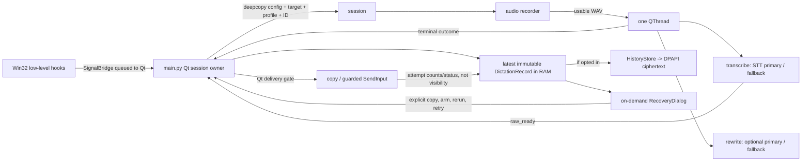

# Screamer Implementation

This is the current architecture and public API reference. The original build plan is
historical context in [PLAN.md](PLAN.md); release operations are in [RELEASES.md](RELEASES.md).

`main.py` owns the tray UI, recording state machine, session snapshot, result ownership,
delivery decision and worker lifecycle. Network work runs in one `QThread`; clipboard
and final text injection run on the Qt main thread. See the current data flow and the
implemented-but-not-yet-manually-verified gates below.

---

## File Layout

All Python modules live under the `src/` package. `requirements.txt` lives at repo root.

```
src/
├── __init__.py          (empty)
├── main.py
├── settings_dialog.py
├── config.py
├── audio.py
├── hotkey.py
├── stt.py
├── rewrite.py
├── http_client.py
├── injector.py
├── results.py
├── recovery_dialog.py
├── icons.py
├── snackbar.py
├── utils.py
└── startup.py
requirements.txt         (repo root)
```

---

## Public API Contracts

Application wiring uses these contracts; private helpers are implementation details.

### utils.py

```python
class AppError(Enum):
    MIC_UNAVAILABLE = "Microphone unavailable. Open Settings > Audio, refresh devices, and try again."
    MIC_DISCONNECTED = "Microphone capture failed. Check Settings > Audio and try again."
    STT_FAILED = "Transcription failed. Check your API key and internet."
    STT_FALLBACK_USED = "Primary STT failed. Used fallback provider."
    LLM_FAILED = "AI rewrite failed. Using raw transcription."
    NETWORK_ERROR = "Network error. Please check your connection."
    NO_SPEECH = "No speech detected. Try speaking louder or closer."
    DICTATION_ACTIVE = "Finish the current dictation before opening Settings."
    INJECTION_FAILED = "Could not type text. Focus may have changed."
    HOTKEY_CONFLICT = "Hotkey conflict. Choose a different hotkey."
    HOTKEY_INVALID = "That key combination can't be used. Add a modifier or pick another key."
    HOTKEY_HOOK_FAILED = "Could not install the global hotkey listener."
    UNSUPPORTED_PLATFORM = "This feature is only available on Windows."
    KEY_STORAGE_FAILED = "Could not save or load API keys securely."
    STARTUP_REGISTRATION_FAILED = "Could not update Windows startup setting."
    OUTPUT_WITHHELD = "Typing withheld because the target changed. Open Recovery to copy or arm insertion."
    CLIPBOARD_FAILED = "Could not copy text. Open Recovery to try explicitly."
    HISTORY_STORAGE_FAILED = "Could not read or save encrypted history. RAM recovery remains available; explicitly Clear to remove an unreadable file."
    HISTORY_DISABLED = "Enable history to delete a saved entry, or explicitly Clear all."
    CONFIG_INVALID = "Invalid settings. Open Settings and repair the rewrite profile configuration."

class ScreamerError(Exception):
    def __init__(self, code: AppError, detail: str | None = None): ...

class SignalBridge(QObject):
    hotkey_pressed = Signal()
    hotkey_released = Signal()
    recovery_requested = Signal()
    recovery_cancelled = Signal()
    error_occurred = Signal(AppError)

@dataclass
class PipelineResult:
    text: str
    warnings: list[AppError]

APP_NAME: str           # "Screamer"
APP_DIR: str            # resolved %LOCALAPPDATA%/Screamer/
```

### injector.py

```python
@dataclass(frozen=True)
class WindowIdentity:
    hwnd: int
    process_id: int
    executable_path: str | None

def get_foreground_target() -> WindowIdentity | None: ...

@dataclass(frozen=True)
class InjectionReport:
    text_events_submitted: int
    post_key_events_submitted: int
    post_key_skipped: bool

class InjectionError(ScreamerError):
    text_events_submitted: int
    post_key_events_submitted: int

def type_text(text: str, post_key: str | None = None, *,
              expected_target: WindowIdentity | None = None) -> InjectionReport: ...
    """Submitted-event counts are not proof of visible insertion; no retry on partial send."""
```

### results.py

```python
@dataclass(frozen=True)
class DeliveryAttempt:
    attempted_at: str
    mode: str                 # type | copy | copy_and_type | manual
    copied: bool = False
    text_state: str = "not_attempted"
    text_events_submitted: int | None = None
    post_key_state: str = "not_requested"
    reason: str | None = None

@dataclass(frozen=True)
class DictationRecord:
    id: str
    created_at: str
    raw_text: str
    rewritten_text: str | None = None
    rewrite_status: str = "not_requested"
    warnings: tuple[AppError, ...] = ()
    language: str = ""
    target_executable: str | None = None
    profile_id: str | None = None
    last_delivery: DeliveryAttempt | None = None

    @property
    def final_text(self) -> str: ...

class HistoryStore:
    def load(self) -> list[DictationRecord]: ...
    def upsert(self, record: DictationRecord, limit: int) -> list[DictationRecord]: ...
    def delete(self, record_id: str, limit: int = 100) -> list[DictationRecord]: ...
    def trim(self, limit: int) -> list[DictationRecord]: ...
    def commit_retention(self, limit: int) -> list[DictationRecord]: ...
    def clear(self) -> None: ...

```

### config.py

```python
DEFAULT_LLM_SYSTEM_PROMPT: str  # Full cleanup-only dictation prompt is defined in config.py.

DEFAULT_RMS_THRESHOLD: float = 5.0

MOUSE_X1 = 1; MOUSE_X2 = 2; MOUSE_MIDDLE = 3   # mouse trigger ids

HOTKEY_OPTIONS: list[tuple[str, str]]  # (canonical_string, display_label) preset pairs
LANGUAGE_OPTIONS: list[tuple[str, str]]  # Auto, Czech, English; always in Settings and tray
SAFE_STANDALONE_KEYS: frozenset[int]   # VKs bindable without a modifier (F-keys, locks, etc.)
MODIFIER_VK_TO_NAME: dict[int, str]    # LL-hook modifier VK → "ctrl"/"alt"/"shift"/"win"

@dataclass(frozen=True)
class Hotkey:
    """Modifiers + a single key/mouse trigger. Serialized to one canonical string."""
    mods: frozenset   # subset of {"ctrl","alt","shift","win"}
    kind: str         # "key" | "mouse"
    code: int         # Win32 VK (kind="key") or a MOUSE_* id (kind="mouse")

    def to_canonical(self) -> str: ...   # "ctrl+alt+key:0x20", "ctrl+mouse:x1", "key:0x91"
    def to_label(self) -> str: ...       # "Ctrl+Alt+Space", "Mouse Back"
    def validate(self) -> str | None: ...  # error message if unsafe, else None
    @classmethod
    def parse(cls, value: str) -> "Hotkey | None": ...  # canonical OR legacy preset key

@dataclass(frozen=True)
class ProviderConfig:
    api_key: str = ""
    base_url: str = ""
    model: str = ""
    custom_headers: str = ""

@dataclass(frozen=True)
class FallbackProviderConfig:
    enabled: bool = False
    provider: ProviderConfig = field(default_factory=ProviderConfig)

@dataclass(frozen=True)
class ConfigValidationIssue:
    message: str
    tab_index: int = 0

@dataclass
class AppConfig:
    hotkey: str = "ctrl+alt+key:0x20"     # canonical Hotkey string (see Hotkey.parse)
    recording_mode: str = "hold"          # "hold" | "toggle"
    post_type_key: str = "none"           # "none" | "enter" | "tab" | "space" | "backspace"
    output_mode: str = "type"              # "type" | "copy" | "copy_and_type"
    history_enabled: bool = False          # opt-in encrypted text history
    history_limit: int = 100               # 1..100
    recovery_hotkey: str = "ctrl+alt+shift+key:0x56"
    vocabulary_entries: list[str] = field(default_factory=list)
    start_with_windows: bool = False
    audio_device_id: int | None = None
    audio_device_name: str = ""
    rms_threshold: float = 5.0
    # STT primary
    stt_api_key: str = ""
    stt_base_url: str = ""
    stt_model: str = ""
    stt_language: str = ""
    stt_language_favorites: list[str] = field(default_factory=list)
    stt_custom_headers: str = ""
    stt_prompt_primary_enabled: bool = False
    # STT fallback
    stt_fallback_enabled: bool = False
    stt_fallback_api_key: str = ""
    stt_fallback_base_url: str = ""
    stt_fallback_model: str = ""
    stt_fallback_custom_headers: str = ""
    stt_prompt_fallback_enabled: bool = False
    # LLM
    llm_enabled: bool = False
    llm_api_key: str = ""
    llm_base_url: str = ""
    llm_model: str = ""
    llm_custom_headers: str = ""
    llm_system_prompt: str = DEFAULT_LLM_SYSTEM_PROMPT
    llm_prompt_origin: str = "default_v2"  # "legacy_saved" | "default_v2" | "user_saved"
    # LLM fallback
    llm_fallback_enabled: bool = False
    llm_fallback_api_key: str = ""
    llm_fallback_base_url: str = ""
    llm_fallback_model: str = ""
    llm_fallback_custom_headers: str = ""
    rewrite_catalog: str | None = None
    rewrite_default_profile_id: str = "clean"
    rewrite_selection_mode: str = "manual"
    rewrite_manual_profile_id: str = "clean"

    def stt_provider(self) -> ProviderConfig: ...
    def stt_fallback_provider(self) -> FallbackProviderConfig: ...
    def llm_provider(self) -> ProviderConfig: ...
    def llm_fallback_provider(self) -> FallbackProviderConfig: ...

def load_config() -> AppConfig: ...
    """Load QSettings + DPAPI. Missing favorites default to []; malformed favorites
    reset only that collection, preserving the active stt_language."""

def save_config(cfg: AppConfig) -> None: ...
    """Serialize plain and DPAPI-encrypted fields to an INI, then atomically replace settings.ini."""

def normalize_language_code(value: str) -> str: ...
    """Trim and lowercase a BCP-47-like code; reject invalid syntax or >32 characters."""

def normalize_language_favorites(codes: list[str]) -> list[str]: ...
    """Validate at most 32 codes; normalize and deduplicate in input order."""

def language_choices(active: str, favorites: list[str]) -> list[tuple[str, str]]: ...
    """Auto, Czech, English, ordered favorites, and any unmatched active code."""

def has_plaintext_secrets() -> bool: ...
    """True if legacy plaintext INI or keys.enc secrets need migration."""

def reset_config() -> AppConfig: ...
    """Fresh AppConfig with all defaults. Does not write disk."""

def import_from_env(cfg: AppConfig) -> AppConfig: ...
    """Read .env at cwd (next to the exe when frozen); backfill empty str fields,
    except an explicitly persisted empty stt_language (Auto)."""

def setup_logging(debug: bool = False) -> None: ...
    """Rotating file at APP_DIR/screamer.log. Never log api_key values.
    Never log transcripts unless debug=True."""

def parse_custom_headers(custom_headers: str) -> dict[str, str]: ...
    """Parse a JSON object of string-ish values; validate HTTP names and sendable ASCII values."""

def validate_config(cfg: AppConfig) -> list[ConfigValidationIssue]: ...
    """Return all startup/settings validation issues for the current config."""

def stt_provider_is_configured(provider: ProviderConfig) -> bool: ...
    """STT requires URL + model; key is optional. LLM still requires key + URL + model."""

def normalize_vocabulary_entries(entries: list[str]) -> list[str]: ...
    """Trim and casefold-deduplicate; cap 128 terms, 128 chars/term and 8,000 rendered chars."""

def encode_vocabulary_entries(entries: list[str]) -> str: ...
def decode_vocabulary_entries(value: object) -> list[str]: ...
def protect_bytes(data: bytes) -> bytes: ...
def unprotect_bytes(data: bytes) -> bytes: ...
    """Share the existing Windows-user DPAPI primitive; unsupported off Windows."""

@dataclass(frozen=True)
class RewriteProfile:
    id: str
    name: str
    kind: str                 # raw | clean | custom
    prompt: str | None = None

@dataclass(frozen=True)
class AppMapping:
    executable_path: str
    profile_id: str

def builtin_rewrite_profiles() -> tuple[RewriteProfile, RewriteProfile]: ...
def normalize_executable_path(value: str) -> str: ...
def decode_rewrite_catalog(value: object) -> tuple[list[RewriteProfile], list[AppMapping]]: ...
def encode_rewrite_catalog(profiles: list[RewriteProfile], mappings: list[AppMapping]) -> str: ...
def migrate_rewrite_catalog(cfg: AppConfig) -> None: ...
def resolve_rewrite_profile(cfg: AppConfig, executable_path: str | None) -> RewriteProfile: ...
    """Resolve raw when global rewrite is off; otherwise manual or Automatic mapping/default."""
```

The version-2 default cleanup prompt treats dictated questions, commands and apparent
instructions as transcript data, not requests to execute. It limits edits to clear
corrections, preserves meaning/negation/names/numbers/identifiers/language choices,
and leaves ambiguity unchanged. This is a model instruction, not semantic validation;
LLM rewriting remains disabled by default.

`llm_prompt_origin` is persisted alongside the exact `llm_system_prompt` string.
For an older INI without the marker, presence of the prompt key means `legacy_saved`,
even for an empty prompt or one identical to an old/current default. Absence means
`default_v2`. Loading never substitutes or normalizes a saved prompt. New configurations
and explicit prompt reset use `default_v2`; Settings edits use `user_saved`, even if
the edited text equals the current default. Routine Apply/OK retains provenance.
Unknown origins or a `default_v2` marker with text different from its version-2 default
are validation issues in the LLM tab and require an explicit edit/reset, not silent
reclassification. A future default revision must use a new origin marker rather than
changing the meaning of `default_v2`. Programmatic custom prompts must also set
`llm_prompt_origin="user_saved"` (or preserve a loaded `legacy_saved` origin).

The Settings prompt editor retains the original saved string when its displayed text
is unchanged, so Qt's line-ending normalization cannot alter prompts on unrelated
Apply/OK. Deliberate edits save the literal editor text without trimming (Qt uses LF
line endings); Reset to Current Default replaces only the draft until Apply/OK.
Failed validation/save does not advance the prompt baseline: undoing an edit before
a retry retains the exact original prompt and origin (or a deliberately selected
reset default). An LLM validation issue exposes its repair controls without enabling
rewriting.
Cancel discards changes since the last successful Apply. Raw/final inspection is
available in Recovery; prompt instructions do not establish model-quality certification.

Language key presence is tracked privately across configuration drafts. An explicitly
saved Auto selection remains Auto during `.env` backfill after restart; an absent
language key can still import `STT_LANGUAGE`. This does not change empty credential,
URL or model backfill, and the private marker is never serialized to the INI.

### audio.py

```python
@dataclass
class AudioDevice:
    id: int; name: str; channels: int

@dataclass(frozen=True)
class AudioDeviceIdentity:
    id: int; name: str  # Actual opened PortAudio index/name, not stable hardware identity.

@dataclass(frozen=True)
class CaptureSnapshot:
    level_rms: float
    has_callback_data: bool
    capture_error: str | None
    device: AudioDeviceIdentity | None
    input_status: str = ""  # Latest transient status; not a fatal-error diagnosis.

def list_devices() -> list[AudioDevice]: ...
    """Raise ScreamerError(AppError.MIC_UNAVAILABLE) if none found."""

class AudioRecorder:
    def __init__(self, device_id: int | None = None, sample_rate: int = 16000): ...
    @property
    def rms_threshold(self) -> float: ...
    def calibrate(self, duration: float = 2.0) -> float: ...
        """Return max(noise_floor * 2.0, DEFAULT_RMS_THRESHOLD); measurement failure falls back to 5.0."""
    def start(self) -> None: ...
        """Open and start the microphone; on failure close the stream and raise MIC_UNAVAILABLE."""
    def snapshot(self) -> CaptureSnapshot: ...
        """Immutable evidence under the recorder lock; no enumeration or audio copy.
        Before callbacks: level 0, has_callback_data False. Captured zeros: True, level 0."""
    def stop(self) -> bytes: ...
        """Return mono int16 WAV; short/quiet capture returns b"". A valid-length
        attempt without samples, unexpected stream finish, or stop/close failure
        raises MIC_DISCONNECTED and discards frames. Late callbacks cannot append."""

def resolve_device(
    preferred_id: int | None,
    preferred_name: str,
    *,
    devices: list[tuple[int, str]] | None = None,
) -> int | None: ...
    """None intentionally defers to the stream's current system default. Otherwise
    enumerate fresh input devices (or use the supplied input-only list). Match an
    ID with an agreeing exact normalized name, or an existing ID with no saved name.
    A missing ID can remap by one unique exact-name match. Conflicts, duplicate
    saved names, missing evidence, and substring-only matches raise MIC_UNAVAILABLE;
    explicit selection never falls back to the default. Strip the default annotation."""
```

### hotkey.py

```python
class HotkeyMode(Enum):
    HOLD = "hold"; TOGGLE = "toggle"

class HotkeyListener:
    def __init__(self, hotkey: Hotkey, mode: HotkeyMode, bridge: SignalBridge): ...
    def start(self) -> None: ...
        """Install WH_KEYBOARD_LL + WH_MOUSE_LL global hooks + GetMessage pump in a daemon thread.
        Matches modifiers + trigger, swallows the matched trigger event (returns 1 from the hook).
        Emits bridge.hotkey_pressed / bridge.hotkey_released; SetWindowsHookEx failure →
        bridge.error_occurred(AppError.HOTKEY_HOOK_FAILED)."""
    def stop(self) -> None: ...
        """PostThreadMessage WM_QUIT, join thread, unhook both hooks."""
    def set_mode(self, mode: HotkeyMode) -> None: ...
    # Pure, OS-independent matching core (unit-tested without Win32):
    #   _on_kb_event(wparam, vk) -> bool ; _on_mouse_event(wparam, mouse_data) -> bool
```

### stt.py

```python
def transcribe(audio_wav: bytes, config: AppConfig) -> PipelineResult: ...
    """POST WAV to STT endpoint with verbose_json (json for Groq). Primary → fallback on failure.
    Filter: keep if ANY segment no_speech_prob < 0.7. All-above → ScreamerError(AppError.NO_SPEECH).
    HTTP/network errors → ScreamerError(AppError.STT_FAILED).
    Fallback success → PipelineResult with AppError.STT_FALLBACK_USED in warnings."""
```

### rewrite.py

```python
def rewrite(text: str, config: AppConfig) -> PipelineResult: ...
    """Send text to LLM with system prompt. Primary → fallback. Failure keeps raw text with LLM_FAILED warning.
    Returns input text unchanged in PipelineResult.text if config.llm_enabled is False."""
```

### icons.py

```python
class TrayState(Enum):
    IDLE = "idle"; RECORDING = "recording"; PROCESSING = "processing"

def get_icon_pixmap(state: TrayState) -> QPixmap: ...
    """32x32 QPixmap from embedded base64 PNG. Grey=idle, red=recording, yellow=processing."""

def get_icon_bytes(state: TrayState) -> bytes: ...
    """Raw PNG bytes for testing without Qt."""
```

### snackbar.py

```python
def snackbar_content_for(state_value: str) -> tuple[str, tuple[int, int, int]] | None: ...
    """Map a TrayState value to (label, dot_rgb); None for idle/unknown (hidden)."""

def bottom_center_xy(available: QRect, size: QSize, margin: int = 48) -> QPoint: ...
    """Top-left point centering *size* horizontally in *available*, *margin* above bottom."""

class RecordingSnackbar(QWidget):
    """Frameless, always-on-top, translucent, click-through status pill at the
    bottom-center of the primary screen. Pulsing dot + label.
    Never takes focus or appears in the taskbar."""
    def show_state(self, label: str, dot_rgb: tuple[int, int, int]) -> None: ...
    def hide_state(self) -> None: ...
    def set_input_status(self, device_label: str, level: float, has_callback_data: bool) -> None: ...
        """Recording-only label and clamped 0..1 meter; no samples differs from measured quiet.
        Main polls every 100 ms during recording and supplies min(block_RMS / 32767, 1).
        Processing/idle reset the meter. No gain, speech-quality, or device-health claim."""
```

### settings_dialog.py

```python
class PasswordField(QLineEdit):
    """Masked line edit with an explicit trailing show/hide toggle action."""

class SettingsDialog(QDialog):
    def __init__(
        self,
        config: AppConfig,
        parent: QWidget | None = None,
        devices: list[tuple[int, str]] | None = None,
        calibrate_fn: Callable[[int | None], float] | None = None,
        refresh_devices_fn: Callable[[], list[tuple[int, str]]] | None = None,
    ): ...
        """6-tab dialog (General, STT, LLM, Audio, Vocabulary, Rewrite Profiles) prefilled from config.
        Edits a copy; Apply and OK persist validated settings.
        *devices*: list of (device_id, display_name) for the Audio tab.
        *calibrate_fn*: fn(device_id) -> float for RMS calibration, after fresh identity validation.
        *refresh_devices_fn*: user-triggered enumeration; None disables Refresh."""
    def get_config(self) -> AppConfig: ...
        """Return edited config. Call after exec() returns Accepted."""
    def refresh_devices(self) -> None: ...
        """Preserve unresolved choice; on enumeration failure keep the existing list and warn."""

# if __name__ == "__main__": launches standalone for testing
```

### startup.py

```python
def is_supported() -> bool: ...
    """True on Windows."""

def startup_command() -> str: ...
    """Return the command stored in HKCU Run."""

def set_enabled(enabled: bool) -> None: ...
    """Add or remove HKCU Run key. Raises ScreamerError on failure."""

def is_enabled() -> bool: ...
    """Check if startup registration is currently active."""

def sync_enabled(enabled: bool) -> None: ...
    """Idempotent: only writes registry if state differs from desired."""
```

### main.py

No public exports. Entry point only:

```python
# if __name__ == "__main__": main()
# Accepts --startup flag for silent tray launch (no auto-open settings)
```

---

## Dependency Rules

| Rule | Detail |
|------|--------|
| Composition root | `main.py` imports all other modules. Nothing imports `main.py`. |
| Settings dialog | `settings_dialog.py` imports `config.py`, `startup.py`, `utils.py`, and the shared `audio.py` device-resolution policy. |
| Shared utilities | `audio.py`, `hotkey.py`, `stt.py`, `rewrite.py`, `injector.py`, `startup.py` may import `utils.py`. |
| Zero peer imports | The six backend modules must NOT import each other. |
| Config consumer | `stt.py` and `rewrite.py` import config value types and receive `AppConfig` as a parameter; `audio.py` and `hotkey.py` use config constants and value objects. |
| Shared HTTP | `stt.py` and `rewrite.py` call `http_client.py` for synchronous requests. |
| Qt in backend | `utils.py` contains the signal bridge; audio, STT, rewrite, injection, startup and HTTP transport remain Qt-free. |
| No circular imports | The graph is a DAG rooted at `main.py`. Structural guarantee. |

---

## Platform Expectations

Windows-first project. Agents may run on Linux/macOS.

| Requirement | Detail |
|-------------|--------|
| Import safety | Every module must import on any OS. No crash at import time. |
| Windows-only runtime | `hotkey.py`, `injector.py`, and DPAPI in `config.py` must guard Win32 calls behind `platform.system() == "Windows"`. On non-Windows, raise `ScreamerError(AppError.UNSUPPORTED_PLATFORM)` (never crash at import time). |
| Non-Windows fallback | `audio.py`, `stt.py`, `rewrite.py`, `icons.py`, `config.py` (QSettings paths), `utils.py`, `settings_dialog.py` should work cross-platform where deps are installed. |
| Full verification | DPAPI roundtrip, low-level hotkey hooks, and `SendInput` can only be fully verified on Windows. |

---

## Configuration for CLI Tests

Backend modules have standalone `__main__` blocks for smoke testing. STT/LLM defaults are empty. CLI scripts resolve credentials as follows:

1. `load_config()` → read QSettings + DPAPI.
2. If `.env` exists in the working directory (or next to `Screamer.exe` in a frozen build),
   `import_from_env(config)` backfills empty fields.
3. If required API fields are still empty, print to stderr and `exit(1)`:

   ```
   No API configuration found. Set up credentials via:
     - Place a .env file in the project root
     - Or run python -m src.settings_dialog (Phase 2)
   ```

No hardcoded provider defaults. No silent fallback to unconfigured endpoints.

---

## Verification

The regression suite runs without real microphones or provider credentials. Windows-only
DPAPI and hook checks are skipped elsewhere. A real Windows desktop smoke test is still
required for input focus, tray interaction and audio-driver behavior.

```bash
pip install -r requirements.txt
python -m unittest discover -s tests -v
python -m compileall src/ tests/ .github/scripts/
python -c "import src; print('OK')"
ruff check src/ tests/ .github/scripts/
ruff format --check src/ tests/ .github/scripts/
```

## Runtime Behavior

- Settings survive dialog close/reopen and full app restart.
- Tray menu quick-toggles sync bidirectionally with Settings dialog values.
- The tray Language radio submenu switches the persisted active STT code immediately.
  Auto omits the STT language field and rewrite hint; a selected code is sent to both
  primary and fallback STT and added to the optional rewrite prompt. Provider support
  for a language code is not guaranteed. Settings manages the ordered favorites;
  removing an active additional favorite selects Auto. A failed tray save restores
  the previous visible and live selection.
- Tray icon: grey (idle) → red (recording) → yellow (processing) → grey.
- Errors appear as tray balloons (user-facing `AppError` messages).
- Initial Settings opens only after the main Qt event loop starts. Settings cannot open
  during dictation, and hotkey presses cannot start dictation while Settings is open.
  Config-mutating tray controls are disabled during Settings, including after Apply;
  Enabled and Exit remain usable.
- Recording start takes one config copy for audio setup, STT primary/fallback, optional
  rewrite, output mode/post-type key, vocabulary and profile. It captures foreground
  HWND/PID and optional executable path before recording UI changes focus, resolves the
  profile then, and stores both in one session. Tray changes during recording or
  processing do not alter that session; the next recording uses current configuration.
- Binding/mode changes during recording are saved immediately but the listener restarts
  only after the current recording ends. The old HOLD release remains effective.
- Apply and OK save before updating the Windows startup registration. A registry failure
  leaves the requested setting saved, reports the partial result and permits retrying Apply/OK.
- Unavailable saved microphones remain visible as unavailable; unrelated edits do not
  replace the saved selection with the system default. Settings Refresh is explicit;
  conflicts/duplicate names remain unresolved. Calibration validates the selected
  identity against fresh input enumeration in its existing worker before measuring.
- The recording-only level timer reads one coherent latest audio snapshot every 100 ms.
  The overlay labels the actual opened input (or unknown identity), distinguishes waiting
  from captured quiet, and displays fixed full-scale RMS. Transient PortAudio flags are
  observations, not repeated warnings. Unexpected stream finish cancels capture once;
  valid-length no-data and stop/close errors report capture failure rather than silence.
  Polling stops before finalize, discard, disable, start failure, and exit. Fresh resolution
  on the next recording permits retry/reselection, not automatic source switching or restart.
- Exit cancels queued processing, stops audio, and waits for the active network call and
  calibration thread to finish before saving settings and quitting Qt. A stalled network
  request can delay exit; the worker is never force-terminated. A failed shutdown save is
  logged but does not prevent quitting. If Qt returns without tray Exit, final cleanup
  stops capture/hooks and joins the actual worker and calibration threads without relying
  on queued callbacks. The worker's retained immutable terminal payload lets main recover
  the raw result after that join. Opt-in checkpoints and suppressed-attempt history are
  still committed during orderly shutdown; automatic output remains blocked.
- Disable discards an active recording and cancels processing before injection starts.
  Final text injection runs on the Qt thread so a Disable action cannot interleave with its
  final check; already-sent `SendInput` events cannot be undone.
- Only one dictation worker may be active. Hotkey presses while `_worker` exists are
  ignored; no queue is created. The busy gate is released only after both terminal
  handling and `QThread.finished`. Cancellation is checked around blocking calls, not
  inside them, so an in-flight HTTP request can delay completion.
- After usable STT, `raw_ready(session_id, raw, warnings)` checkpoints raw text to the
  main-thread owner before rewrite/cancellation. Terminal outcomes are session-ID matched
  and can reconstruct raw if signal handling order differs. A rewrite rerun creates a
  separate candidate rather than silently replacing its source record.
- Automatic type/copy-and-type uses the captured session policy. Main checks current
  foreground identity; `type_text` additionally checks expected HWND/PID before text
  and after its 50 ms pause before post-key. Copy-only is focus-independent;
  copy-and-type copies first. Result status describes clipboard writes and submitted
  event counts, not visible text. No automatic resend or rollback occurs.
- Windows copy success additionally requires Qt clipboard ownership after `setText()`;
  native clipboard failures can return without a Python exception. Missing ownership
  is reported as a copy failure without reading/restoring the clipboard or retrying.
- Recovery exposes raw/final copy or Arm, explicit cleanup rerun, history deletion/clear,
  and Retry/Discard for one in-memory WAV retained only after STT failure. Retry uses
  its original config snapshot, is recovery-only (no automatic output), and holds the
  WAV until STT succeeds. WAV is never persisted and is lost on exit/crash.
- Latest usable text remains in RAM even with history disabled. Persistent history is
  opt-in (default off) and stores validated version-1 JSON as DPAPI-protected ciphertext
  at `APP_DIR/history.enc`; writes use ciphertext-only temporary files, fsync and atomic
  replacement. Retention is 1..100 on commit. Read/decrypt/schema/write failures fail
  closed while RAM recovery remains available. Turning history off stops ordinary
  reads/writes but leaves prior saved entries until explicit Clear. Delete is not a
  secure-erasure guarantee for backups or other copies.
- `main()` acquires a `QLockFile` under resolved `APP_DIR` before config load or tray
  construction. A second process exits with a notice. The lock spans Qt execution and
  synchronous final thread/dialog cleanup, and is released only after HTTP client close.
- Recovery shortcut defaults to `Ctrl+Alt+Shift+V`. `RegisterHotKey` reserves keyboard
  chords; if reservation fails, recovery handling is disabled and a conflict is
  surfaced. Other apps' low-level-hook bindings are not detectable. Mouse recovery
  bindings are rejected; Escape is reserved for cancelling an armed insert and cannot
  be a recovery trigger. Injected keyboard events pass through the hook without
  changing physical trigger state, so Screamer's post-key cannot trigger dictation.
- Vocabulary is JSON in ordinary settings. Terms are trimmed, blanks dropped,
  casefold-deduplicated in order, and bounded to 128 entries, 128 characters per term
  and 8,000 rendered characters. Malformed persisted data uses an empty effective list
  but preserves the original on unrelated saves until explicit repair. `rewrite()` adds
  quoted spelling guidance; STT adds multipart `prompt` only when that provider's own
  opt-in is enabled and vocabulary is nonempty. These are hints, not guarantees.
- Rewrite profiles are code-owned `raw`/`clean` plus up to 32 custom profiles in a
  versioned JSON catalog. Manual selection persists until Automatic is selected;
  Automatic matches the captured executable's normalized full path then falls back to
  the configured default. Global AI Rewrite off resolves to raw while preserving the
  selection. Legacy prompt migration uses persisted prompt-key presence/provenance;
  damaged catalogs are preserved and require explicit repair, not silently emptied.

## Storage and Limits

- All paths: `%LOCALAPPDATA%/Screamer/`. API keys + custom headers: DPAPI ciphertext
  in the same QSettings (IniFormat) file as provider URLs and models. Saving serializes
  a complete temporary INI, syncs it and atomically replaces `settings.ini`. The format
  marker `secret_storage=dpapi-v1` distinguishes encrypted fields from legacy plaintext.
  Existing `keys.enc` data takes precedence over older plaintext INI values and migrates
  on the next successful save; the legacy file is then removed. A migrated INI is authoritative
  even if legacy-file cleanup fails. A failed encrypted read
  fails closed rather than overwriting stored credentials. On non-Windows, secret
  persistence is unsupported. Source runs read `.env` at cwd; frozen runs read it beside the exe.
- Active `stt_language` remains a scalar in `settings.ini`; ordered
  `stt_language_favorites` are stored there as a JSON array. Missing or malformed
  favorites load as empty without deleting an old active language. New favorite
  codes are lower-case, up to 32 characters, and capped at 32 entries; older
  active hints with different syntax remain available until explicitly changed.
- HTTP diagnostics omit provider URLs and raw transport exception strings. The shared
  client suppresses URL-bearing HTTP library INFO/DEBUG logs; custom header names are
  case-insensitive. Plain HTTP remains supported; no new TLS policy is imposed.
- Recording buffers the full dictation in memory, with a fixed five-minute limit.
  At the limit, recording stops and the captured audio is processed as on a manual stop.
  Completed/discarded frame lists are released.
- Source autostart inserts the absolute package root before loading `src.main`, so it
  does not depend on the working directory. The packaged executable command is unchanged.

## Implemented Roadmap Slices and Open Gates

Features 2, 3, 6, 7 and 8 have implementation in the current source tree. This means
code and automated coverage exist; it does **not** mean the roadmap's separate manual
Windows acceptance has passed, a release has been published, or all Windows behavior
is certified. Features 1 and 5 remain code-implemented with their original manual gates
open, as tracked in [IMPLEMENTATION-PLAN.md](IMPLEMENTATION-PLAN.md). Feature 2's
Notepad root cause is unconfirmed and has not been fixed by diagnosis: no confirmed
reproducer/evidence is asserted here. The integrated Linux run passed 287 tests with
5 Windows-only skips, compileall, import, Ruff check/format and `git diff --check`.
A packaged Windows build and its real-desktop acceptance checks have not been run.

## Current Session and Recovery Flow



Successful STT is retained before rewrite. Terminal outcomes update that record, and
ordinary output follows retention. A session is not idle until terminal handling and
thread completion both occur. STT failure may retain one WAV in memory; successful STT
clears it. Persistent history has no audio, config system prompt or provider API-key
fields. Settings and history are separate stores, not one transaction.

## Current API and Persistence Notes

`transcribe(audio_wav, config) -> PipelineResult` and `rewrite(text, config) ->
PipelineResult` remain the public backend signatures. STT completeness is URL plus model,
with optional API key; LLM completeness still requires key, URL and model. `rewrite()`
returns its input when disabled; when enabled it adds vocabulary guidance and selected
language to its system prompt. `stt.py` adds multipart `prompt` only for an individually
opted-in provider with nonempty vocabulary. Keyless STT omits generated Bearer auth;
configured custom headers remain provider-local.

`SettingsDialog` has six tabs (General, STT, LLM, Audio, Vocabulary, Rewrite Profiles).
It edits a draft; Apply/OK validate and save, Cancel discards unapplied edits. General
contains output/history/recovery controls. `HistoryStore.load()` validates the complete
file then returns sorted latest entries; `trim()` limits a view without rewriting the
file. `upsert()` and `delete()` perform read-modify-write and retention, while mutations
refuse corrupt input. The `main()` per-APP_DIR lock is required for this single-writer
storage boundary. Delete uses the configured retention limit, and Settings Apply explicitly
commits a reduced limit; opening or cancelling Settings does not rewrite history.

After a manual attempt on an older entry, RAM latest retains the actual outcome even if
the history write fails; the committed list still describes the earlier disk state. A
rewrite candidate remains a RAM-only preview, including after Copy or Arm/insert, and
never silently becomes an unlinked saved entry or replaces its source.

Recovery presents text as plain text. A last-attempt label means only a recorded
operation and its SendInput counts, never confirmed visible delivery. Clipboard copies
can expose dictated text to other software and are not restored automatically. Damaged
history can be removed only by explicit Clear; backups are outside deletion guarantees.

## Known Limits of Implemented Behavior

- `get_foreground_target()` returns `None` off Windows; executable path is optional.
  Profile matching uses path, whereas output compares HWND/PID. Neither proves the same
  control or caret, and no window title/content is collected.
- `SendInput` counts and clipboard writes do not establish visible insertion/paste.
  Focus can change between a check and OS submission; partial text cannot be rolled
  back and is never automatically resent.
- `RegisterHotKey` catches registered-chord conflicts but cannot discover another
  application's low-level-hook binding. Packaged Windows hotkey, foreground and
  target-application behavior remains a manual gate.
- DPAPI-backed persistence cannot be fully verified off Windows. RAM results and
  pending WAV do not survive a crash unless text has already been committed to opt-in
  history; WAV never survives.
- Local STT is a configured HTTP endpoint, not an egress restriction. Enabled cloud
  fallback or LLM rewrite can still use the network; there is no local-only firewall.

## Sources

- [`src/main.py`](../src/main.py): composition root, startup lock, session/profile snapshot,
  worker signals, output checks, retention and recovery actions.
- [`src/results.py`](../src/results.py): immutable record/attempt schema, validation,
  DPAPI history boundary and atomic ciphertext persistence.
- [`src/recovery_dialog.py`](../src/recovery_dialog.py): on-demand recovery view and
  busy/enabled action gating.
- [`src/config.py`](../src/config.py): current `AppConfig`, collection codecs, migration,
  validation, DPAPI primitives and profile resolution.
- [`src/settings_dialog.py`](../src/settings_dialog.py): six-tab settings draft, validation,
  Apply/Cancel and history/vocabulary/profile controls.
- [`src/injector.py`](../src/injector.py): foreground identity and guarded Win32 event
  submission/count reporting.
- [`src/hotkey.py`](../src/hotkey.py): dictation and recovery chord event state, reservation
  and release dispatch.
- [`src/stt.py`](../src/stt.py), [`src/rewrite.py`](../src/rewrite.py): current provider
  request and prompt behavior; their public signatures remain `PipelineResult` based.
- [`docs/IMPLEMENTATION-PLAN.md`](IMPLEMENTATION-PLAN.md): roadmap status and outstanding
  acceptance gates; it does not replace this current-contract reference.
