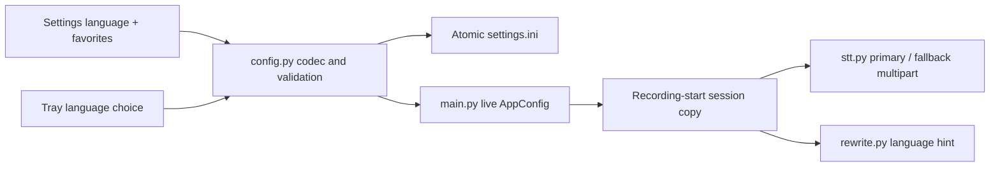
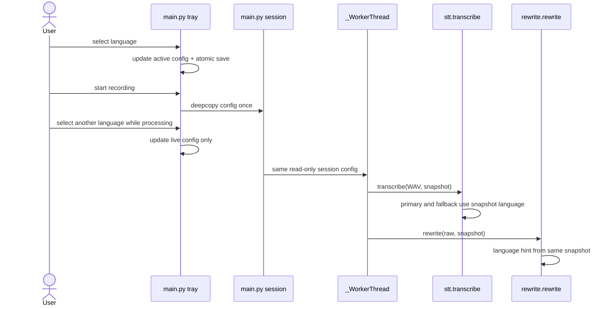

# 1. Quick Language Switching in the Tray

> **Status:** planned, not shipped. This plan expands P0 from
> [FEATURES.md](../FEATURES.md#1-quick-language-switching-in-the-tray-p0).
> Current `AppConfig` still has only `stt_language`.

## Summary

Add an ordered, user-managed set of frequently used STT language codes while
keeping `AppConfig.stt_language` as the one active value. The tray is the fast
switching surface; Settings manages the available favorites. The critical
boundary is recording start: main takes one `deepcopy(AppConfig)` before
recording and does not mutate that session snapshot afterward. A tray selection
changes live/persisted config only, so an active session's primary STT,
fallback STT and rewrite hint remain consistent.

## Start Here

- [`src/config.py`](../../src/config.py): `AppConfig`, `load_config`,
  `save_config`, `validate_config`; owns persistence codecs and validation.
- [`src/main.py`](../../src/main.py): `_rebuild_menu`, `_add_choice_submenu`,
  tray setters and recording lifecycle; owns visible active choice and session
  timing.
- [`src/settings_dialog.py`](../../src/settings_dialog.py):
  `SettingsDialog._build_stt_tab`, `_populate`, `_collect`; owns draft editing.
- [`src/stt.py`](../../src/stt.py) and [`src/rewrite.py`](../../src/rewrite.py):
  consume `stt_language` without a signature change.

## Proposed Data Contract

Add `stt_language_favorites: list[str] = field(default_factory=list)` to
`AppConfig`; retain `stt_language: str = ""`, with empty meaning automatic
detection. Serialize favorites under `stt_language_favorites`, e.g.
`"[\"cs\",\"en\",\"de\"]"`. The domain
codec belongs in `config.py`, not a generic collection registry:

```python
def encode_language_favorites(codes: list[str]) -> str: ...
def decode_language_favorites(value: object) -> list[str]: ...
def normalize_language_code(value: str) -> str: ...
```

These are proposed private-or-module helpers, not shipped APIs. Canonical
language identifiers should be trimmed lower-case BCP-47-like tags (for
example `cs`, `en`, `pt-br`); do not claim validation against a complete
IANA/provider catalog. Reject malformed syntax at the Settings validation
boundary. A suggested engineering bound is 32 characters/code and 32
favorites; these are practical limits, not agreed product requirements. Stable
deduplication is case-insensitive after normalization, preserving first order.
`""` is not a favorite: Auto is always a fixed tray choice.

Known labels can be a small local mapping (`cs` -> `Czech`, `en` -> `English`);
unknown valid codes display their code. Do not add a provider registry or imply
that every configured STT provider supports every code.

## How It Works



### Persistence and migration

The existing loader only coerces scalar dataclass fields. Add explicit decoding
for this one JSON-backed list. Distinguish a missing INI key from malformed
contents:

| Stored state | Active language after load | Favorites after load |
| --- | --- | --- |
| Key absent (old install) | Preserve existing `stt_language` | `[]` |
| Valid JSON array | Preserve active value | Normalize and deduplicate |
| Malformed JSON, wrong root type, invalid entries | Preserve active value | Safe empty list; log a non-sensitive warning |
| Valid legacy language from INI or `.env`, not a favorite | Preserve it | Do not silently discard it from the active display |

When building tray choices, include Auto, Czech and English, all favorites,
and the current nonempty active code if otherwise absent. This prevents an old
configured value or `.env` backfill from becoming invisible. Do not infer that
an active code should be made a favorite.

`save_config` continues to write the single atomic INI replacement. Encode the
list explicitly rather than relying on QSettings' QVariant list conversion.
The favorites and active value are saved in one config write, so a tray
selection persists the same `stt_language` edited by Settings.

### Settings draft and tray

Replace the free-text-only STT language editor with an active-language control
and ordered favorites editor, or a compact equivalent that supports add,
rename/edit and remove. Keep Czech and English available independent of the
favorites list. Unknown currently active values must remain selectable/displayed
until the user explicitly changes them. The dialog's existing deep-copy model
means Cancel discards active language and favorite edits; Apply/OK validate and
persist both together.

The tray `Language` submenu follows existing `_add_choice_submenu`: one
exclusive visible selection, Auto plus built-ins and current favorites. On
selection, update live config, save, then rebuild or reflect selection. On
save failure, restore the old live active value and keep the displayed choice
consistent with persisted state; report the save error. Keep this action
independent of future profiles.

### Session timing and requests

At the very beginning of `_start_recording`, create the one session
`copy.deepcopy(self._config)` before starting audio or allowing any subsequent
tray config mutation. The private main-owned session retains that exact config;
it is read-only after capture. Pass it through finalization to `_WorkerThread`.
Do not take a second backend snapshot or change `transcribe(audio_wav, config)`
or `rewrite(text, config)` signatures.

`stt.transcribe` already reads the same `config.stt_language` for its primary
and fallback attempts and omits `language` when empty. `rewrite.rewrite` already
appends that language as a hint. Preserve this behavior: the hint is not a
translation instruction. A language change during capture or network work
updates live config and disk for the next session only.

| Invariant / race | Owner and enforcement |
| --- | --- |
| One authoritative active language; favorites are only menu choices. | `AppConfig.stt_language` in config/Settings/tray; never derive it from list order. |
| Failed tray save does not advertise an unsaved active choice. | Main rolls back live code and visible radio selection before reporting error. |
| Session language never changes after recording starts. | One main-owned config copy; worker uses it for both STT attempts and rewrite. |
| Settings Apply cannot overwrite an intervening tray selection. | Disable config-mutating tray controls while modal Settings nested event loop runs. |
| Invalid favorites do not erase an old valid scalar language. | Config decoder defaults only the malformed collection, preserving the scalar. |



## Data Flow

1. Startup loads scalar `stt_language` and explicitly decodes favorites; a
   missing/malformed favorite value does not erase the active setting.
2. Settings edits a deep-copy draft; Apply/OK validates and atomically saves
   the active code and ordered favorites, while Cancel drops the draft.
3. A tray choice persists a new active code immediately; it does not mutate an
   active session's copy.
4. Recording start captures one config snapshot; STT primary/fallback and
   optional rewrite consume that same language value.

## Key Dependencies

- P0 ships independently of app profiles. Do not store language under a profile
  or make profile selection a prerequisite.
- `_add_choice_submenu` provides the tray's existing radio-choice pattern;
  `SettingsDialog`'s Apply/Cancel workflow remains authoritative for drafts.
- STT language support is provider-dependent; this feature chooses a hint and
  does not guarantee recognition quality or intra-utterance code switching.

## Known Risks

- The original plan calls for malformed favorites to "fall back safely" but
  does not specify whether to clear favorites or fail settings load. Clearing
  only the malformed collection while preserving `stt_language` is the least
  destructive policy; surface/log a warning without language data.
- The original plan gives no code grammar, count cap or item length. The
  proposed defaults above are engineering constraints and should be confirmed
  in implementation review; they are not acceptance criteria.
- Settings runs a nested Qt event loop. Tray callbacks can execute while the
  dialog draft is open. The shared integration rule is to disable
  config-mutating tray actions during Settings (leave Enable and Exit usable)
  so an Apply cannot overwrite a concurrent tray change. This belongs in the
  shared tray/settings integration, not in the language codec.
- Provider acceptance of codes cannot be determined from this repository;
  unknown-code display is necessary because an in-house exhaustive catalog
  would be misleading.

## Slices and Verification

1. Add codec, `AppConfig` field and load/save/validation tests. Cover missing
   key migration, malformed JSON, wrong root type, normalization, stable
   deduplication, invalid syntax, bounds, ordering, and round trip.
2. Add STT Settings editing and test initial population, Apply/OK persistence,
   invalid edit rejection and Cancel behavior, including an unknown active code.
3. Add tray submenu and persistence handling; test Auto, `cs`, `en`, extra
   favorite, unknown active selection, failed save rollback and visible choice.
4. Capture at recording start; test tray change during recording/processing
   affects next snapshot only. Extend request tests to assert primary,
   fallback and rewrite hint all use the old snapshot; Auto omits STT field and
   rewrite hint.
5. Windows manual: switch during a long recording and confirm current/next
   request behavior. Automated request tests do not establish real provider
   language quality.

## Sources

- [`docs/FEATURES.md`](../FEATURES.md#1-quick-language-switching-in-the-tray-p0):
  required behavior, acceptance and P0 independence.
- [`docs/IMPLEMENTATION-PLAN.md`](../IMPLEMENTATION-PLAN.md#1-quick-language-switching-in-the-tray-p0):
  initial design, migration intent and tests; underspecifies schema and limits.
- [`src/config.py`](../../src/config.py): current scalar `stt_language`,
  scalar-only load coercion, atomic INI save and `.env` backfill.
- [`src/settings_dialog.py`](../../src/settings_dialog.py): current free-text
  language field and deep-copy/Apply/Cancel workflow.
- [`src/main.py`](../../src/main.py): tray submenu pattern, immediate setters,
  mutable live config passed to worker today, session integration point.
- [`src/stt.py`](../../src/stt.py), [`src/rewrite.py`](../../src/rewrite.py):
  current language propagation and automatic-language omission.
- [`tests/test_config.py`](../../tests/test_config.py),
  [`tests/test_settings_dialog.py`](../../tests/test_settings_dialog.py),
  [`tests/test_tray_menu.py`](../../tests/test_tray_menu.py),
  [`tests/test_stt_rewrite.py`](../../tests/test_stt_rewrite.py): existing
  observable test boundaries.
