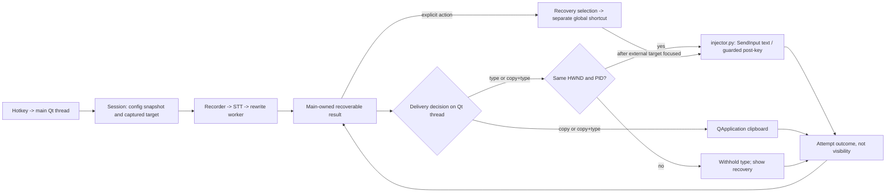

# 2. Reliable Insertion and Clipboard Output

> **Status:** planned, not shipped. Expands [feature 2](../FEATURES.md#2-reliable-insertion-and-clipboard-output-p1). Requires the small in-memory recovery slice of [feature 3](03-recovery.md) before automatic output can be withheld.

## Review and gate

`main.py:_on_worker_succeeded` currently sends text to whatever is foreground at completion and reads the *live* post-key setting. `injector.type_text` sends UTF-16 keyboard events in one batch, then sleeps 50 ms and sends a separate post-key batch. Partial `SendInput` counts already mean some events may have reached the app. A successful count proves neither visible text nor a particular caret. The old `_watch_release` diagnosis does not apply to the current low-level hotkey hook.

**Windows diagnosis comes first:** reproduce browser succeeds / Notepad reports success without visible text, comparing hold/toggle, modifier-release order, focus transitions, Notepad/OS versions, Unicode/surrogates, line breaks and post-key on/off. Observe target HWND and process ID, hotkey event order, returned `SendInput` event counts and `GetLastError` only; never capture window titles, dictated text or secrets. Test a plain editor too and check partial insertion. Only change the responsible Win32/hotkey behavior after reproduction; if it cannot be reproduced, mark the Notepad root cause unconfirmed, not fixed. The guarded-output work remains useful independently.

## Architecture



`main.py` owns session timing, clipboard, cancellation and result state. `injector.py` owns runtime-guarded Windows identity and injection. It must not call Qt. `stt.py` and `rewrite.py` remain unchanged by output policy. The history UI never performs insertion merely because it is open.

## Proposed types and contracts

```python
# injector.py; import-safe on Linux, Windows calls guarded at runtime
@dataclass(frozen=True)
class WindowIdentity:
    hwnd: int
    process_id: int
    executable_path: str | None  # optional; NOT part of target equality

def get_foreground_target() -> WindowIdentity | None: ...

@dataclass(frozen=True)
class InjectionReport:
    text_events_submitted: int
    post_key_events_submitted: int
    post_key_skipped: bool

class InjectionError(ScreamerError):
    # AppError.INJECTION_FAILED plus the counts known at failure.
    text_events_submitted: int
    post_key_events_submitted: int

def type_text(
    text: str, post_key: str | None = None,
    *, expected_target: WindowIdentity | None = None,
) -> InjectionReport: ...
```

`WindowIdentity`'s HWND and PID must both match for automatic typing; an unavailable executable path does not veto a verified window. Query Windows foreground HWND, owning PID and optional full executable path with explicit `ctypes` signatures; do not read a title, control content or clipboard. HWND reuse is why PID joins the comparison; the same PID/HWND still cannot prove the same field/caret. Returning `None` on identity failure is safer than guessing. `expected_target` is mandatory for guarded app calls; retaining an optional parameter only permits the existing standalone injector CLI/API to keep its unguarded behavior. Main must never pass `None` for automatic or recovery insertion. Check HWND/PID *inside injector immediately before text SendInput* and again after its 50 ms pause, immediately before post-key SendInput. The main-thread precheck is for the withhold/recovery decision, not a substitute for these checks. No focus restoration. A race remains between each check and OS submission.

`InjectionReport` and `InjectionError` keep text and post-key effects distinct. Validate post-key against known choices before sending; an invalid post-key is not success. The expected event count is `len(text.encode('utf-16-le', errors='surrogatepass'))` (one key-down and one key-up per two-byte code unit). If text SendInput submits fewer events, raise with the *returned event count* and do not attempt post-key or resend text. A returned count of zero is reported failure, not proof that nothing was inserted in the target. If text completed but focus changed during the pause, return `post_key_skipped=True`; if post-key SendInput is partial/failed, raise with full text count and post-key count. Neither condition reclassifies the completed text attempt as failed text. Preserve error codes/details without logging the text.

Config additions: `output_mode: Literal['type', 'copy', 'copy_and_type']` (stored as a validated string, default `type`); keep `post_type_key`. Capture both in the one `deepcopy(AppConfig)` at `_start_recording`. `DeliveryAttempt` and its composite outcome are defined in [feature 3](03-recovery.md); one flat success/failure flag cannot describe `copy_and_type` with a successful copy and partial type.

## Function-level flow

| Function / owner | Required behavior |
| --- | --- |
| `_TrayApp._start_recording()` | Freeze config and capture target on Qt thread before any app UI can take focus; keep `None` if not obtainable, never recapture from the worker. P0 snapshot is already the single snapshot. |
| `_TrayApp._on_worker_succeeded(...)` | Associate terminal worker outcome with session ID, retain result before side effects; if cancelled/disabled/exiting/Settings open, retain but perform neither copy nor type. Call one main-thread delivery method otherwise. |
| `_TrayApp._deliver_result(session, record)` | `copy`: write selected final text to `QApplication.clipboard()` and record copy outcome, ignoring target. `type`: compare captured/current HWND+PID, then guarded injector. `copy_and_type`: copy first, then apply the same typing guard even if focus has changed; never infer type success from copy success. An actual clipboard exception is surfaced separately. |
| `get_foreground_target()` | Return HWND, PID, optional executable path; guard Windows-only runtime. Process metadata failure cannot invalidate the HWND/PID pair. |
| `type_text(..., expected_target=...)` | Recheck immediately before text events, report submitted count including partial failure, recheck immediately before post-key; no automatic retry or rollback. |
| Settings `_collect()` / validation | Validate only three output values; Apply/OK persist via current atomic INI flow, Cancel discards; selected session remains unchanged. |
| `_TrayApp._on_recovery_shortcut()` | Consume only an explicitly armed raw/final choice, after the full hotkey chord is released and an external destination is focused; capture *current* target, reject Screamer-owned UI, call guarded injector once, then disarm regardless of attempt. Never use old session target as manual destination. |

Recovery selection in the tray/history offers **Copy raw/final** and **Arm insert raw/final**. Copy is always a straightforward alternative: user focuses another app and pastes with its own paste command. Arm insert hides the recovery window; a dedicated configurable global recovery shortcut (proposed default `Ctrl+Alt+Shift+V`, checked for conflicts with the dictation hotkey and other installed apps) inserts the armed choice into the externally focused app. The dictation hotkey keeps its recording meaning. There is exactly one armed choice, replaced or cancelled on new arm/Escape, disable or exit; it never automatically fires on window activation. Preserve arm across dialog hide but not process exit. The hook must dispatch only after release of the full shortcut chord to avoid held modifiers affecting injection; test both modifier-release orders on Windows before promising this. If the hook cannot distinguish or safely time that release, manual insert must not ship until resolved; copying remains available. A failed manual attempt leaves the text in recovery and never schedules a second send. This follows the *interaction pattern*, not the data-retention or automatic-retry behavior, documented by [Wispr Flow's Windows recovery shortcut and History Copy](https://docs.wisprflow.ai/articles/7971211038-fix-text-not-pasting-after-dictation); do not copy its automatic retry or clipboard restoration policies.

Reject manual insertion when Screamer Settings, recovery UI, tray/menu, or other Screamer-owned foreground HWND is focused, and while recording/worker busy or disabled/exiting. Use Win32 process ownership / known UI windows rather than executable basename, title or widget text; elevated destination failure is an error, not an invitation to escalate. The external user's focus after hiding history is the destination. A focused wrong *external* field is still possible and remains the user's explicit responsibility.

## Timing and concurrent events

```mermaid
sequenceDiagram
    actor User
    participant Q as main Qt thread
    participant W as worker
    participant I as injector Win32
    participant C as Qt clipboard
    User->>Q: start dictation (external app focused)
    Q->>I: get_foreground_target()
    I-->>Q: HWND + PID + optional path
    Q->>Q: freeze AppConfig / target in session
    User->>Q: change live output setting or focus
    W-->>Q: raw_ready then terminal success
    Q->>Q: retain result BEFORE output
    alt cancelled / disabled / exiting / Settings open
        Q->>Q: retain only; no automatic side effect
    else copy-only
        Q->>C: setText(final)
    else type or copy+type
        opt copy+type
            Q->>C: setText(final)
        end
        Q->>I: compare captured HWND+PID to current
        alt mismatch / unknown
            Q->>Q: withhold type; offer recovery
        else match
            Q->>I: type_text(final, snapshot.post_key, target)
            I->>I: check target immediately before text SendInput
            I->>I: SendInput text; record count
            I->>I: wait 50ms; recheck target; optional post-key
            I-->>Q: report or partial/error with counts
        end
    end
    Q->>Q: store actual attempt outcome
```

All UI state and clipboard writes run on the Qt thread. A queued hotkey disable cannot interleave *within* a synchronous main-thread `type_text` call, but a user focus change from another process can. The guard narrows, never closes, that gap. Worker cancellation is cooperative at network boundaries; never copy/type just because a late worker result arrived. `QThread.finished` and success/cancel/failure are separate signals; keep the session busy until terminal handling and finished are both complete (see [feature 3](03-recovery.md)). On a storage error, preserve the in-memory result and report the history failure independently of output outcome.

| Situation | Copy | Text events | Post-key | Result/recovery |
| --- | --- | --- | --- | --- |
| `type`, target missing/changed | none | withheld | none | final/raw retained, actionable notice |
| `copy`, target missing/changed | attempt copy | none | none | copy error independent of target |
| `copy_and_type`, target changed | attempt copy | withheld | none | describe both outcomes separately |
| Partial text SendInput | prior copy may have succeeded | reported count, possible prefix | none | explicit recovery; never resend automatically |
| Full text, then focus changes | prior copy may have succeeded | fully submitted | skipped | post-key warning, not a text failure |
| Full text, post-key fails | prior copy may have succeeded | fully submitted | failed/partial | report post-key separately |
| Disabled/cancelled/exit/Settings | none | none | none | recoverable text if STT already succeeded; explicit action later |

## Slices and verification

1. **Diagnosis gate:** collect the stated Windows evidence and a minimal reproducible case, add regression for the discovered cause. Do not claim it passed until tested on the target Notepad version. Guarded output is separate from confirming that bug.
2. **Recovery prerequisite:** complete feature 3's in-memory raw/final retention and tray-accessible Copy before enabling withheld output. A withhold without retrieval is a regression.
3. **Identity and injection:** add HWND/PID capture, pre-send and post-key checks, structured returned counts and error propagation. Test nonexistent/changed/reused HWND, missing executable path, partial surrogate pair events, post-key skip/failure and exactly one text SendInput call. Mocks prove the control flow, not a real Windows caret.
4. **Output modes:** add config/Settings codec validation and session-frozen output policy; test copy-only, copy+type, copy failure, cancellation, Settings, disable, changed target and late worker success with Qt offscreen clipboard state restored after tests.
5. **Explicit recovery:** add selectable raw/final choice and dedicated shortcut, test arm/cancel/rearm, wrong internal target, busy gate, release ordering, no auto retry and manual failure retaining content. Windows manual: browser, editor, Notepad, hold/toggle, mixed-script/line breaks, target change, non-editable/elevated app, and focused external recovery action.

No Windows desktop claim can be inferred from a passing Linux Qt mock. A clipboard write changes the user's clipboard and can leave sensitive text there; there is no automatic restoration. Capture and output do not promise exactly-once insertion, universal paste support or reliable field/caret identity. Update [current contracts](../IMPLEMENTATION.md) and README only as each slice ships.
