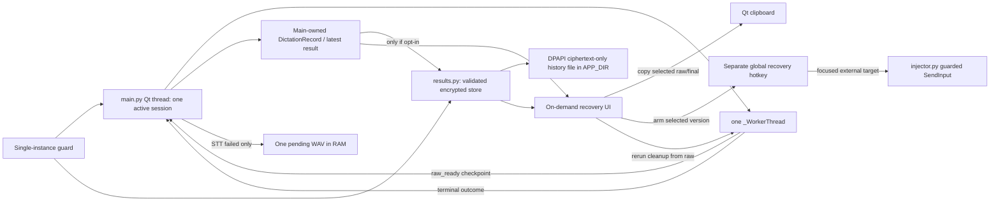

# 3. Recoverable Dictation and Local History

> **Status (2026-09-30):** code implemented; final automated checks and Windows/DPAPI manual acceptance remain open. Current schema and persistence behavior are canonical in [IMPLEMENTATION.md](../IMPLEMENTATION.md). Expands [feature 3](../FEATURES.md#3-recoverable-dictation-and-local-history-p1); this detailed page retains the design rationale and acceptance record, not the current API reference.

## Current-source review and decisions

`main.py:_WorkerThread` currently emits only final `PipelineResult(text, warnings)`; after STT succeeds the original raw transcript is thrown away when rewrite finishes. `_on_worker_succeeded` loses the text on injection failure. `AudioRecorder.stop()` returns WAV bytes transiently, and `QThread.finished` clears the busy gate separately from worker outcome signals. `rewrite()` returns raw plus `LLM_FAILED` when both providers fail, but exceptions from elsewhere still need raw retention. No in-memory result or history UI exists. None of the following types, files or UI are implemented today.

**Chosen persistence policy:** opt-in text history, off by default; default maximum 100, configurable 1..100. During this process lifetime keep the latest usable result even when persistence is off. Keep **one pending WAV** in memory only after STT failure; never store WAV in history. Versioned JSON is encrypted with Windows-user DPAPI *before* writing any file; Windows-only persistence. The user approved **one running app instance per user data directory**; acquire that guard before loading/saving settings, opening the microphone/hotkey or reading/writing history. The second process exits with an actionable notice. No IPC or multi-writer protocol.

## Architecture and source of truth



`main.py` owns session state, one pending WAV, and latest in-memory result. `results.py` owns one record schema, validation, serialization and encrypted history operations; it must not import Qt or orchestrate worker threads. `recovery_dialog.py` is an optional on-demand Qt view of *copies* of these records, not a second authority. Settings INI is authoritative only for opt-in and retention preferences. History ciphertext file is authoritative for *committed persisted entries*, not pending audio or a guarantee that external text appeared. Keep the existing `PipelineResult` public API for `stt.py` and `rewrite.py`.

## Proposed data contracts

```python
# results.py (proposed, not shipped; ONLY text record types are serialized)
@dataclass(frozen=True)
class DeliveryAttempt:
    attempted_at: str               # UTC ISO-8601; no attempt is last_delivery=None
    mode: str                       # type | copy | copy_and_type | manual
    copied: bool                    # clipboard write confirmed, not paste
    text_state: str                 # not_attempted | withheld | events_submitted | reported_failed
    text_events_submitted: int | None  # known returned count; None if no attempt/unknown
    post_key_state: str             # not_requested | submitted | skipped | reported_failed
    reason: str | None              # controlled reason code, never dictated text

@dataclass(frozen=True)
class DictationRecord:
    id: str                         # opaque generated ID, not text hash
    created_at: str                 # UTC ISO-8601
    raw_text: str                   # nonempty only after STT success
    rewritten_text: str | None
    rewrite_status: str             # not_requested | pending | succeeded | failed | cancelled
    warnings: tuple[AppError, ...]
    language: str
    target_executable: str | None   # path when available; NEVER window title
    profile_id: str | None          # populated after feature 7
    last_delivery: DeliveryAttempt | None

    @property
    def final_text(self) -> str:
        return self.rewritten_text if self.rewrite_status == "succeeded" else self.raw_text

```

`main.py` additionally owns `PendingAudio(wav: bytes, config: AppConfig)` in RAM
and `RewriteCandidate(source_record_id: str, text: str, warnings: tuple[AppError, ...])`
in RAM for on-demand inspection. Neither belongs to the history schema or is
serialized. The pending config is the *one original session snapshot*, not a
new copy of live Settings.

Fallback-provider **success** is `rewrite_status="succeeded"`; it produces valid rewritten text. `failed` means raw fallback and `LLM_FAILED` warning, not a successful LLM rewrite. `not_requested` covers disabled rewriting / future raw profile. `cancelled` may still carry raw text but never permits automatic output. No redundant `fell_back` rewrite status: the current `rewrite()` API does not report which provider produced successful text. STT fallback remains visible via `AppError.STT_FALLBACK_USED`. Do not fabricate an LLM fallback warning from the current result. `final_text` is defined even when cleanup failed or was cancelled; that does **not** authorize auto-delivery.

An STT failure creates `PendingAudio` only if `stop()` returned usable WAV. Its config preserves language, provider keys and request policy from the old dictation, even if Settings changes later; the retry is explicit and never uses the old HWND for automatic typing. A successful STT clears the pending WAV; release the worker's byte reference too when transcription returns rather than holding it through rewrite. A new successfully started recording replaces/discards pending audio; explicit Discard or exit clears it. Starting a recording that fails to open must not destroy pending audio. Retained bytes may contain sensitive speech and are lost on crash. `PendingAudio` is never serialized or passed to the recovery UI (only expose a Retry/Discard affordance).

## Worker signals and ownership

Proposed private main-owned `_Session(id, config, target, started_at, ...)` retains the *same* deep-copied `AppConfig` captured at recording start; no second backend snapshot. `raw_ready = Signal(object)` emits `(session_id, PipelineResult)` immediately after STT succeeds and **before** a cancellation check or rewrite call. Terminal signal carries `(session_id, raw, rewrite_result_or_error, outcome)` so main can reconstruct a missed/late queued raw checkpoint; no duplicate history record. Worker never writes history, opens windows or owns mutable result state. Main processes each signal on the Qt thread and upserts record by ID: terminal cancellation/failure cannot erase raw text. Existing `transcribe(audio, config)` and `rewrite(raw, config)` signatures remain. Rewrite fallback via returned warning is not an exception; unexpected rewrite exceptions still yield raw retained with `LLM_FAILED` surfaced.

```mermaid
sequenceDiagram
    actor User
    participant Q as main Qt/session owner
    participant W as _WorkerThread
    participant STT as transcribe
    participant LLM as rewrite
    participant Store as DPAPI history store
    User->>Q: start; freeze config and target
    User->>Q: release; usable WAV
    Q->>W: session ID, WAV, same config snapshot
    W->>STT: transcribe(WAV, snapshot)
    alt STT fails
        W-->>Q: failed(session ID, STT error, no raw)
        Q->>Q: keep at most one pending WAV in RAM
    else STT succeeds
        STT-->>W: PipelineResult(raw, warnings)
        W-->>Q: raw_ready(session ID, raw)
        Q->>Q: upsert raw checkpoint; release WAV
        opt opt-in history
            Q->>Store: encrypt and atomically commit checkpoint
        end
        W->>W: check cancellation
        opt not cancelled and rewrite enabled
            W->>LLM: rewrite(raw, snapshot)
        end
        W-->>Q: terminal(session ID, raw, rewrite outcome)
    Q->>Q: retain final BEFORE any output
    Q->>Store: commit text checkpoint only if opt-in
    Q->>Q: auto-output only if still eligible
    Q->>Q: update last_delivery with actual attempt or withhold
    Q->>Store: commit last_delivery update only if opt-in
    end
    W-->>Q: QThread.finished (separate lifecycle event)
    Q->>Q: clear busy gate after terminal AND finished
```

Qt cross-thread signals are queued and disable/exit can be processed between raw and terminal. Do not assume HTTP cancellation interrupts a blocking call. Identity-bearing signals and one owner prevent a late result from mutating a *new* dictation. If `finished` arrives before a queued terminal handler, keep the active busy gate until both have been handled; do not start another dictation merely because `_worker is None`. Conversely, do not rely on terminal success to signal the QThread has stopped. A late terminal result from a disabled/cancelled session may update recovery, but cannot copy/type. Exit waits for worker completion; do not hang waiting for a signal that cannot arrive, and treat normal shutdown separately from a crash. No queue of simultaneous dictations; rerun/retry uses the same single worker slot and stays explicit.

| Stage / interruption | Raw available? | Pending WAV? | Automatic output? |
| --- | --- | --- | --- |
| Too short/quiet/no usable WAV | no | no | no; re-record |
| STT errors with usable WAV | no | yes, until replacement/discard/exit | no |
| STT succeeds, LLM pending | yes; checkpoint main thread | no | not yet |
| LLM failed/empty output | yes; raw final + warning | no | only if session still eligible |
| Disable/cancel after STT | yes; possible latest/history | no | never; explicit recovery after re-enable |
| Full text events, post-key fails | yes | no | no repeat; delivery distinguishes stages |
| App crashes | in-memory result lost | lost | no crash recovery promise; only *committed* opt-in history survives |

## Encrypted history contract

```python
# results.py; suggested small boundary, not generic storage framework
def load_history(limit: int) -> list[DictationRecord]: ...
def commit_history(records: list[DictationRecord], limit: int) -> None: ...
def delete_history_entry(record_id: str, limit: int) -> None: ...
def clear_history() -> None: ...
```

Use `APP_DIR/history.enc`, one versioned JSON payload `{ "version": 1, "entries": [...] }`, UTF-8 encoded in memory; protect bytes with the existing Windows-user DPAPI primitive via a narrow shared call rather than copying `ctypes` code. Write **only encrypted bytes** to a temp file in the same directory, flush/fsync and `os.replace`; never create plaintext JSON on disk. No **configuration system prompts**, provider API credentials or audio in history. Raw/rewritten dictated text **includes dictated AI prompts** and can include spoken secrets; warn users explicitly before opt-in. `AppError.HISTORY_STORAGE_FAILED` (new enum member) reports read/decrypt/validate/write/delete failure without logging payloads or ciphertext dumps. DPAPI is per Windows account, not a guarantee against that account, clipboard, backups or external apps reading the text.

Commit raw after `raw_ready` (crash recovery for that committed checkpoint), then commit the final text/rewrite state before automatic delivery. **After** each automatic or explicit manual delivery attempt, update `last_delivery` in RAM and commit that update when opt-in is on; otherwise restart would show a stale/no-attempt status. This is deliberately not one cross-system transaction. A failure of the post-delivery commit leaves correct in-memory status and an earlier committed text record, but the disk record's last delivery outcome is unconfirmed; report `HISTORY_STORAGE_FAILED`. After restart, label any saved field **"Last recorded attempt at <timestamp>"**, not "Last attempt"; if absent, show "No attempt recorded." A newer attempt may have occurred after the committed one, and a crash prevents discovering that fact. Never retry or repeat `SendInput` to compensate for a failed history write. Withholding for disabled/cancelled/changed-target sessions is an outcome to commit too, without performing a side effect.

Validate version, envelope, record field types, enum codes, nonempty raw and bounded text/count before using loaded records. Reject unsupported versions and corrupt/undecryptable files *without overwriting them*. Keep in-memory recovery working and show the storage error. Limit the in-memory list to the configured recent 1..100; a valid file containing more than 100 records is reduced only after a successful explicit commit, not silently discarded. User-facing history availability means records **committed** to disk; a failed commit is never reported as persisted. Deleting one entry and clearing all mutate the displayed committed list only after successful atomic write/remove; on failure leave the old UI and original file intact. After successful delete, also clear any matching latest in-memory result and armed insert choice; after Clear, clear all current in-memory text and armed selection too. Do not delete the still-active result while a worker could publish another checkpoint for its ID: disable its Delete action until terminal handling and thread finish. The single pending WAV has a separate Discard action. If the file is corrupt, explain and require a separate explicit destructive Clear confirmation before removing the unreadable file, not a routine save that wipes it. Deletion does not promise secure erasure from backups, OS temp files or clipboard.

`history_enabled=False` never loads old entries into ordinary recent-history UI and performs no history write. Switching it off leaves existing encrypted file untouched and states that explicitly; optional deliberate recovery of old entries must ask to open them. Switching back on validates existing file **before** new writes and merges a new in-memory entry by ID with committed records. Do not blindly replace older entries with the latest result. If the file is unreadable, block writes until explicit resolution. The one-instance guard must already be active, and this still does not promise crash durability between raw success and atomic commit. Config preference saving and history committing are *two stores*, not one transaction; report their errors independently, and preserve the raw in RAM if disk fails.

### Single-instance boundary

At program entry, derive a lock scoped to the resolved `APP_DIR` for the Windows user and hold it until all worker/dialog/storage activity is over; the first process starts, a concurrent second process fails **before** `load_config()` (which can migrate secrets and save) or hotkey installation. A cross-process lock file with real process liveness checking (e.g. Qt `QLockFile`, verify stale-lock handling on Windows) is a candidate; do not assume `os.replace` alone serializes read-modify-write. Do not delete a lock owned by a live process. If stale detection cannot reliably distinguish live ownership, fail closed with a recovery instruction rather than overriding it. Off-Windows modules still import and tests run; no claim of Windows multi-session semantics until manually checked. Release the lock on normal exit; OS cleanup/stale-lock recovery on crash must be tested. No local server, IPC activation or background daemon is required.

## Recovery UI and explicit actions

The tray exposes `Recent dictation...` even when disk history is off if a usable in-memory result exists. View raw and final, last attempt and warnings; show bounded opt-in history with Delete/Clear and timestamp/language/application path only where present. Distinguish copied, type withheld, event count submitted, partial failure and post-key skip; never label any entry "delivered to field". `Copy raw/final` writes via Qt clipboard and reports errors, without re-running STT/LLM. `Arm insert raw/final` uses feature 2's dedicated shortcut and guarded *currently focused external* destination; never inserts merely because the recovery window was clicked. Selected recovery text stays in memory even after a failed manual attempt. Copy is a valid alternative when shortcut insertion is unsafe. [Wispr Flow documents History Copy and a separate Windows Paste-last shortcut](https://docs.wisprflow.ai/articles/7971211038-fix-text-not-pasting-after-dictation); Screamer deliberately does not copy its automatic retry, clipboard restore or long-term audio policy.

For failed STT: `Retry STT` starts the single worker with `PendingAudio` and its old config after the prior worker has fully finished; it may succeed into a new record marked recovery-only, never automatically copy/type. Clear pending WAV at `raw_ready`, not on starting retry, so a second explicit attempt remains possible after another STT failure. `Discard` clears it. Disable blocks retry until enabled; exit discards it. No retry of capture failures that produced no WAV.

For rewrite rerun: select stored raw and explicitly start `rewrite(raw, current selected rewrite configuration)` on the one worker. Snapshot current rewrite/provider/language/profile preferences at request time; do not reuse source record's secrets/prompt silently. Render `RewriteCandidate` as text; old record and last delivery stay unchanged. User may explicitly copy/arm candidate or save it as a separate linked entry; no automatic insertion, replacement of the original or STT request. A failed rerun leaves original raw/final untouched. User-controlled content must be rendered as text or escaped rich text. No dedicated difference view is required.

## Slices, error paths and verification

1. **Before feature 2:** define the small record and `raw_ready` / terminal protocol, retain raw on rewrite failure or cancellation, and expose latest raw/final Copy through a tray-accessible UI. Test queued signal/disable/late completion and exception in finalization; retain result before a failed output call. No disk or new worker pool yet.
2. Add `PendingAudio` only for usable WAV after STT failure, explicit retry/discard, replacement at successful new recording and exit. Test failed first retry then successful retry, cancellation while HTTP is in flight and retry-no-auto-output. Confirm memory release on raw checkpoint, not when retry starts.
3. Add single-instance guard before history/settings migrations; integration test a second Windows process cannot become an active writer or second hook owner, and stale-lock recovery after crash. Linux import-safety tests do not establish Windows locking.
4. Add `history_enabled=False`, `history_limit=100` (validate 1..100), Settings disclosure and separate clear. Implement versioned DPAPI store with fail-closed load, ciphertext-only temporary files, atomic commit, eviction, delete and clear. Test 1/100/101 records, corrupt ciphertext, invalid records/version, old file with opt-out, failed replace and re-enable merge; check no audio field or transcript in normal logs. DPAPI tests on Windows; use a fake crypt boundary for Linux codec tests without claiming at-rest protection there.
5. Add bounded browsing, individual delete, clear, raw/final text and explicit recovery/rewrite candidate. Test Settings Cancel, redraw after commit failure, wrong internal foreground, clipboard cleanup in Qt offscreen, no work while busy/disabled/exiting, and stable source after rerun. Manual Windows offline->online STT retry, result recovery, restart with opt-in and clipboard inspection are release gates.

## Limits and alternatives

One latest in RAM plus bounded opt-in text is less sensitive than retaining all WAVs; the cost is that a crash can lose uncommitted text/audio and opt-out history cannot recover across restarts. Atomic file replacement prevents a torn *single-writer* history file, not two-process lost updates; that is why the user-approved single-instance boundary is a prerequisite. A SQL database, event log, crash-proof job queue, model judge and automatic retry would add mechanisms without delivering an accepted guarantee. Update [IMPLEMENTATION.md](../IMPLEMENTATION.md) and README only when behavior actually ships.
