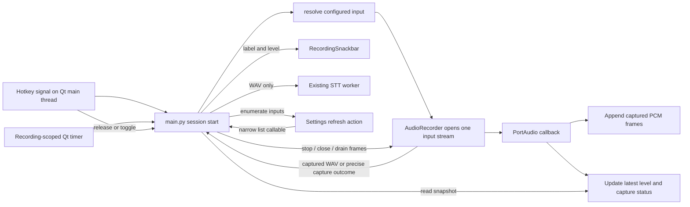

# Microphone Feedback and Recovery

## Summary

This is the detailed implementation plan for feature 5 in
[`../FEATURES.md`](../FEATURES.md): make captured input visible during a
dictation and make device failures recoverable without silently choosing a
different explicitly selected microphone. It is a future plan, not a statement
that the feature is implemented. The existing recording flow is deliberately
single-session: `main.py` owns recording lifecycle and Qt, while `audio.py`
owns PortAudio capture and WAV construction. Keep that boundary. The first
maintainer decision is that a meter reads captured PCM, not a recording-state
animation or a second audio stream; a live level does not prove speech or
intelligibility.

## Start Here

- `docs/FEATURES.md` section 5: the accepted behaviors and hardware acceptance
  criteria this plan elaborates.
- `docs/IMPLEMENTATION-PLAN.md` section 5: the current concise plan and
  cross-feature delivery constraints. This file is its implementation detail,
  not a competing feature definition.
- `src/audio.py`: device resolution, callback-owned frame list, silence gate,
  calibration, stream lifecycle, and current error behavior.
- `src/main.py`: recording start/stop, timer, snackbar, settings device-list
  helper, calibration helper, and user-visible error path.
- `src/snackbar.py`: non-focusable click-through overlay that currently shows
  only Recording or Processing.
- `src/settings_dialog.py`: saved device selection, unavailable-device
  preservation, and calibration controls.
- `src/utils.py`: existing microphone error enum values and `ScreamerError`.
- `tests/test_audio.py`, `tests/test_snackbar.py`,
  `tests/test_snackbar_wiring.py`, `tests/test_settings_dialog.py`, and
  `tests/test_tray_menu.py`: current seams to extend.

## Review of the Existing Plan

Section 5 of `docs/IMPLEMENTATION-PLAN.md` has the right core constraints:
single latest-level observation, recording-only Qt polling, reuse of the
recording RMS gate, fail-closed explicit-device selection, and no idle observer,
audio queue, or per-block Qt signal. This detail makes several implicit parts
explicit before implementation:

- `AudioRecorder` needs a coherent read-only snapshot, not separately read
  level, callback-seen, status, and device properties that can describe
  different instants. The snapshot must identify what actually opened, not
  merely echo the configured preference.
- Stale ID and name must be treated as conflicting identity evidence; current
  `resolve_device()` tries the saved name after an ID mismatch and ultimately
  defaults. Name matching also accepts a substring and returns the first
  duplicate. Both behaviors conflict with section 5's no-silent-switch policy.
- A stream that opened but delivered no callback data is not equivalent to
  captured all-zero frames. Existing `stop()` returns empty bytes for both
  missing frames and quiet captured frames; the new status path must preserve
  this distinction without changing the existing silence threshold.
- The callback currently logs every nonempty PortAudio status. The plan needs
  an explicit rule for bounded status/error reporting, and a shutdown/reset
  contract so a callback cannot append to a discarded or completed session.
- Settings currently receives a one-time device list at dialog construction.
  Keep that ownership but add an explicit refresh action that calls a narrow
  main-owned enumeration function. Do not resolve the device independently in
  the dialog and create a second policy.
- Calibration uses `AudioRecorder(device_id=...).calibrate()` in a worker.
  Device-policy changes must not casually alter its separate selection path;
  calibration should continue targeting the selected device, or its smallest
  required correction should be called out and tested.

## Architecture



The callback has no Qt, network, tray, or logging-per-block responsibility.
The timer runs on the Qt main thread and exists only for the active recording.
It samples a bounded snapshot; it does not consume a queue. Existing worker
thread work starts only after recording stops and a usable WAV is returned.

### Proposed small interface and ownership

These names are proposals, not current APIs. Keep types local and concrete;
avoid a general audio telemetry abstraction.

| Proposed symbol | Owner | Contract |
| --- | --- | --- |
| `CaptureSnapshot` | `audio.py` | Frozen dataclass with `level_rms: float`, `has_callback_data: bool`, `capture_error: str | None`, and `device: AudioDeviceIdentity | None`. Return an immutable copy assembled under the recorder lock. |
| `AudioDeviceIdentity` | `audio.py` | Frozen dataclass with the actual opened PortAudio `id` and `name`; no claim that an index is a permanent hardware identity. |
| `AudioRecorder.snapshot()` | `audio.py` | Read the latest callback observation; no Qt calls, logging, audio copy, or device re-enumeration. Before first callback, data status remains false and level is zero. |
| `AudioRecorder.stop()` outcome | `audio.py` | Preserve current WAV-bytes success and short/quiet empty result if practical, but expose a distinct capture outcome for no callback data. Do not make an empty WAV alone encode all failure reasons. |
| `resolve_device(...)` | `audio.py` | Retain as the one configured-device policy boundary; fail explicitly for unresolved or ambiguous explicit selections and use default only for intentional `None`. |
| `list_devices()` / current default helper | `audio.py` | Continue input-only enumeration and current-default identification, supplying fresh items to main and Settings. |
| `_get_device_list()` | `main.py` | Keep decoration of the current default for display; return fresh input items or the existing empty-list failure result. This is the callable passed to Settings refresh. |
| `_start_recording()` | `main.py` | Freeze a `deepcopy(AppConfig)` at the beginning of recording start, before device resolution/stream startup, then resolve from that copy on every attempt. Start the meter timer only after a successful stream start; discard the new session copy if startup fails. |
| `_poll_recording_level()` | `main.py` | On the main thread, read one snapshot and update the existing snackbar. Surface a persistent capture failure once through the existing tray error route; do not notify on each poll. |
| `RecordingSnackbar.set_input_status(...)` | `snackbar.py` | Accept display label, normalized meter value, and capture/no-data state; retain current pulse, click-through, and non-focusable behavior. |
| `SettingsDialog.refresh_devices()` (or equivalent slot) | `settings_dialog.py` | Ask the injected refresh callable for fresh choices. Update `_select_device` to use the same fail-closed ID/name policy as the recorder, removing its current first-exact/substring fallback; preserve unresolved saved identity until an explicit new choice. |

The session config snapshot belongs in main. Do not add independent snapshots
to audio or the settings UI. There is no recording/network overlap: the one
recording ends before its STT worker begins, and hotkey start is ignored while
that worker exists.

## How It Works

### Device identity and selection

Re-enumerate and resolve on each recording start. Treat `audio_device_id` and
`audio_device_name` together as saved evidence for an explicit choice. A
PortAudio integer ID is an enumeration index, not proof of an enduring device
identity. Names also do not uniquely identify hardware. The resolver must never
guess between conflicting or ambiguous evidence.

| Saved preference and current inputs | Proposed result | Reason |
| --- | --- | --- |
| `audio_device_id is None` (system default is intentional) | Open current default input; if none can be resolved/opened, report unavailable. | `None` is the existing representation of system default. |
| Saved ID exists, is an input, and its exact normalized name agrees with saved name (or saved name is empty) | Use that ID; report the actual opened ID/name. | ID-first matching is useful while the current enumeration remains consistent. |
| Saved ID is stale/missing, saved name has exactly one input match | Use the unique exact-name match, subject to verifying that name-based migration is acceptable for the persisted contract. | It can support replug/re-enumeration, but names are not unique identities. |
| Saved ID now identifies an input whose name conflicts with a nonempty saved name | Fail unavailable and require reselection; do not search by name or use default. | Avoid opening the wrong device after index reassignment. |
| Saved ID is missing and saved name is empty | Fail unavailable and require selection. | There is no evidence for which explicit device was intended. |
| More than one input has the saved exact name | Fail as ambiguous and require selection. | Never take the first duplicate-name device. |
| Only substring/near-name matches exist | Fail unavailable and require selection. | Current substring fallback can select a different microphone. |
| Saved explicit device is absent, current default differs | Fail unavailable; keep saved selection visible in Settings. | Never silently switch an explicit choice to default. |

`src/main.py:_get_device_list()` decorates the current default name with
` (Default input)` for the Settings list. `settings_dialog.py` strips this
suffix when saving a selected device name, and its system-default option has
`None` data. Therefore that display annotation is not currently a saved device
identity when the standard UI path is used. Preserve this normalization and
test it. Legacy/manual configuration could still contain the annotation;
continue normalizing it before comparisons. Do not infer stable Windows device
identity from identical names: the code cannot prove it. Refresh should retain
an unavailable saved item and change it only after the user explicitly selects
another row.

Identify the opened stream from the device selected by the stream **after open**
(and query that ID's exact display name); for System Default do not merely
echo the configured `None` or an earlier default that could change between
resolution and open. If the backend cannot provide a trustworthy opened ID,
display "System Default (device unknown)" rather than a guessed microphone.

`resolve_device()` is also used by recording startup only; Settings calibration
currently passes the combo's selected integer ID directly into `_calibrate()`.
Keep this single selector/resolution policy. Do not add a second device
resolver in Settings. If resolution behavior must be reused for calibration,
make only the smallest change needed to resolve the selected combo identity
before calibration and preserve the calibration worker's existing responsive
behavior. Confirm that default selection remains `None` for calibration and
that explicitly selected unavailable hardware does not silently calibrate a
different default.

### Meter scale and callback snapshot

Input uses mono `int16` at 16 kHz. Calculate each callback block's RMS using
the same mathematical definition as final `stop()` RMS:
`sqrt(mean(int16_samples.astype(float64) ** 2))`. Store the latest block RMS as
one scalar. Keep it in sample units (range 0 through 32767), and normalize only
for display with one documented fixed scale, for example
`min(level_rms / 32767.0, 1.0)`. Do not autoscale to recent loudness or label a
percentage as a calibrated microphone gain. The meter and silence gate then
use consistent RMS units; `rms_threshold` and final WAV acceptance remain
unchanged. A captured all-zero block is `has_callback_data=True`, level zero;
no callback yet is `False`, level zero. These are visually distinguishable
states, not "quiet means broken" heuristics.

Current `_callback()` appends `indata.copy()` while holding `_lock`; `stop()`
concatenates and clears `_frames` under that same lock. Keep callback work
bounded: calculate a block scalar, retain the needed frame copy, and update
scalar/status fields. No per-block Qt signal, queued audio, VAD, waveform
history, disk write, network request, or per-block log. The lock protects the
frame list and the snapshot fields. Do not concatenate or encode WAV while
holding it. If RMS calculation is performed outside the lock, publish it only
as part of the same short locked update as the matching callback-seen state.

The display interval is a tunable engineering parameter, not a product promise:
start around 100 ms (10 Hz) as a modest Qt timer, then adjust only if Windows
UI/hardware checks show a need. Polling reads the latest scalar repeatedly and
may display the same value until another callback arrives. Stop the timer on
finalize, cancel/discard, start failure, disable, and exit. A timer tick must
check that a recording/session is still active before touching its recorder.

### Capture status, errors, and outcome distinction

`AppError.MIC_UNAVAILABLE` and `AppError.MIC_DISCONNECTED` already exist in
`utils.py`; use these unless a source-backed distinct user action/message
requires an addition. Existing `_on_error()` shows a tray warning and logs the
code/detail. Avoid exposing repeated or driver-specific status text as a new
diagnosis. PortAudio status can be transient; a callback status flag alone is
not proof of fatal device failure. Record the bounded latest status/error
observation and promote only a confirmed fatal callback/stream condition or a
failed stop/close according to sounddevice's documented semantics. Do not
invent a driver diagnosis from a status string.

Keep these outcomes distinct:

1. **Open/start unavailable:** resolver finds no valid selection, or stream
   construction/start fails. `_start_recording()` returns to idle, stops any
   meter timer, and reports `MIC_UNAVAILABLE`; no session is labeled as
   capturing.
2. **No callback data:** the stream started, but a valid-length attempt
   received no callback frames. Measure valid length from the existing
   monotonic start/stop timestamps (not sample count, which is zero here).
   Report a capture/no-input failure, not the
   current generic silent/too-short empty-WAV path. Ensure the next hotkey can
   retry after the device is restored.
3. **Captured silence/quiet:** callbacks supplied PCM frames, but frames are
   zero or final aggregate RMS is below the existing threshold. Preserve the
   current silence gate and `NO_SPEECH`/quiet handling; do not call this a
   disconnected device and do not submit a WAV to STT.
4. **Captured usable audio:** callback data exists and the final aggregate RMS
   passes the unchanged threshold. Encode the same in-memory WAV and continue
   through the existing STT worker.
5. **Interrupted/fatal stream or stop/close error:** discard incomplete frames,
   return to idle, and report the existing `MIC_DISCONNECTED` path or a
   clearly justified capture error. Do not claim the meter can recover an
   already interrupted stream; recovery is the next recording after
   reselection/replug.

Do not warn on ordinary pauses or every transient status flag. Report a
confirmed fatal condition at most once per recording, with a concise actionable
message to check/refresh the selected microphone and retry. Do not display
"healthy" merely because the timer runs; before first callback show waiting/no
data, and after data use actual measured level. A low or nonzero signal is not
proof of intelligible speech.

### Recording lifecycle and callback shutdown

Proposed lifecycle sequence:

```mermaid
sequenceDiagram
    participant Q as Qt main / _TrayApp
    participant A as AudioRecorder
    participant P as PortAudio callback
    participant U as RecordingSnackbar
    Q->>A: resolve identity, construct, start()
    A->>A: reset frames, level, callback-seen, error for new session
    A->>P: open and start stream
    Q->>Q: mark recording; start meter timer
    loop while recording
        P->>A: append PCM; update latest snapshot under lock
        Q->>A: snapshot()
        A-->>Q: coherent scalar, data flag, error, actual identity
        Q->>U: update meter and microphone label
    end
    Q->>Q: stop timer before finalize/discard
    Q->>A: stop()
    A->>A: deactivate callback gate under lock
    A->>P: stop and close stream without holding lock
    A->>A: drain/clear frames under lock
    A-->>Q: WAV, quiet/no-data outcome, or ScreamerError
    Q->>U: processing or idle state; no more level polls
```

Reset session fields before opening the new stream, not after it can invoke the
callback. A start failure leaves the recorder inactive and the meter timer
stopped. On stop/cancel, first stop timer and make the session inactive, then
stop/close the stream, then gate/drain frames and snapshot fields under the
lock. The callback must check the active-session gate while holding that lock
before appending or publishing. This orders a callback already in its critical
section before final drain and ignores one arriving after deactivation. Do not
assume without checking that `sounddevice` guarantees callback quiescence merely
because `stream.close()` returned; implementation must follow its actual
callback lifecycle contract. `_TrayApp` constructs a new recorder for each
start, which limits stale-session reuse, but does not remove callback/close
concurrency within that recorder.

On cancel/disable, discard frames exactly as current `_cancel_recording()`
does. On successful stop, move/concatenate the frame references under lock,
clear the recorder-owned list, then compute aggregate RMS and WAV outside the
lock. A callback must not be able to repopulate those frames after deactivation.
On close error, clear frame storage and report failure; never pass partial audio
to STT. Meter snapshots after stop are no longer polled; retain or reset their
values only as needed for deterministic tests, not for an idle display.

### Snackbar, errors, and settings recovery

Extend the existing snackbar rather than create a second overlay. Keep recording
and processing states, primary-screen positioning, current click-through flags,
no-focus policy, pulse, and fade behavior. During recording add a compact label
identifying the actual input (or "System Default - <actual name>" if space and
the opened identity support it) and a small bounded meter. A device label should
not claim a configured name was opened if the actual identity is unavailable.
Avoid turning the overlay into a clickable selector or a modal error surface.
When capture fails, the tray warning plus the existing Settings device list is
the recovery path; the next hotkey makes a fresh resolution attempt.

Settings already receives devices and a calibration callable in its constructor.
Add one narrow optional refresh callable, provided by `_TrayApp` and backed by
`_get_device_list()`, plus a Refresh button on the Audio tab. Refresh only when
the user asks; no background observer. Preserve the saved unavailable row
through refresh and Apply until another device is explicitly chosen. Reuse the
same label normalization, but change `_select_device()` to reject stale/conflicting
IDs and ambiguous names just like `resolve_device()`; never reuse its current
substring/first-match fallback. Enumeration failure
should leave the saved selection intact and report that refresh found no usable
list, rather than rewriting it to system default. Keep Apply/OK/Cancel's
existing deep-copy semantics. Do not restart or replace an active recorder
from Settings; the current app already guards opening Settings during
recording/processing.

## Data Flow

1. A hotkey reaches `_TrayApp` on the Qt main thread. It copies the effective
   `AppConfig`, resolves the configured input afresh, constructs `AudioRecorder`
   for that ID or intentional default, applies the configured RMS threshold,
   and calls `start()`.
2. Only after successful stream start does main mark recording active and start
   a recording-only meter `QTimer`. Each timer tick asks `AudioRecorder` for
   one coherent `CaptureSnapshot` and updates `RecordingSnackbar` on the Qt
   main thread.
3. The PortAudio callback stores captured PCM for the final WAV and replaces
   the latest level/status fields. It performs no UI, networking, or
   per-block logging.
4. On hotkey release/toggle, timeout, or cancel, main stops the meter timer
   before stopping/closing the stream. `stop()` distinguishes no callback data
   from frames rejected by the existing duration/RMS gate; only usable captured
   audio becomes a WAV.
5. Main returns to idle with one actionable microphone error for unavailable,
   no-data, or interrupted capture; quiet captured audio follows the existing
   silence path. Usable WAV bytes alone enter the existing STT/rewrite worker.
6. If the microphone is unplugged/replugged or the default changes after a
   failure, the next attempt resolves fresh. Settings Refresh obtains a new
   device list only on request and does not silently alter the saved choice.

## Key Dependencies

| Boundary | Existing dependency / constraint | Planned use |
| --- | --- | --- |
| Audio capture | `sounddevice.InputStream`, NumPy, `AudioRecorder` | Keep Qt-free; retain one stream and the current 16 kHz mono int16 WAV path. |
| Device preference | `AppConfig.audio_device_id` and `audio_device_name` | No new persistence field is required for the first implementation. Preserve `None` as intentional default. |
| Session ownership | `_TrayApp` and `_recording_timer` | Main thread owns state transitions and meter polling; one active recording and no queue. |
| Display | `RecordingSnackbar` | Extend existing overlay; no focus theft or per-block signal bridge. |
| Error routing | `AppError`, `ScreamerError`, `_on_error()` | Reuse existing microphone codes where their semantics fit. |
| Settings | `_get_device_list()`, `SettingsDialog`, `_select_device()` | Inject a narrow refresh callable and preserve unavailable selection. |
| Calibration | `_calibrate(device_id)` and `_CalibrateThread` | Keep current explicit selected-ID behavior and async UI contract; minimally correct only if shared fail-closed policy requires it. |
| Existing STT | `_finalize_recording()` worker creation | No WAV from missing, quiet, short, or failed capture reaches STT. |

## Concurrency and Lock Scope

The invariants are: no callback may append to frames after deactivation; a
snapshot distinguishes "no sample" from a measured zero; an explicitly chosen
device is never replaced by the default without user action; and the meter
timer cannot outlive its recording. Frames/level/status share one recorder lock,
while no Qt or PortAudio stop/close call may run under it.

| Operation | Thread | Lock rule / permitted work |
| --- | --- | --- |
| Open/start and session reset | Qt main thread | Initialize fields before stream can callback; no UI timer until success. |
| Input callback | PortAudio callback thread | Under one short lock, check active gate, append required frame copy, and publish latest RMS/data/status/device observation. No Qt, HTTP, tray calls, I/O, or logging for every block. |
| Snapshot | Qt main thread via timer | Acquire lock only long enough to copy immutable scalar/status/identity fields. Do not copy frame buffers. |
| Stop/close | Qt main thread | Stop timer and deactivate session; stop/close outside frame-list critical section; coordinate final callback gate and drain under lock. Do not encode or concatenate while locked. |
| WAV/RMS processing | Qt main thread after stream close | Operate on detached captured frames outside lock; preserve current minimum-duration and RMS checks. |
| Settings enumeration / refresh | Qt main thread, user initiated | Reuse main's narrow list function; no idle timer or background device watcher. |
| STT/rewrite | Existing worker after capture | No overlap with an active recording; existing single-worker exclusion remains. |

The callback's frame append can hold the lock while copying a bounded block;
measure only if real tests show contention. The timer never waits for device
enumeration. Keep lock acquisition ordering simple: no lock is held while
calling PortAudio stop/close or Qt. If a callback-shutdown guarantee cannot be
established from the backend contract, settle that before selecting a more
complex synchronization mechanism; do not add queues or a generic coordination
layer preemptively.

## Known Risks

- PortAudio IDs are enumeration indexes; exact names may still collide. The
  fail-closed behavior prevents some wrong-device opens but can require manual
  reselection after legitimate re-enumeration.
- The current source cannot prove identical names map to the same physical
  microphone. Do not claim stable physical identity without a platform-specific
  identity source, which is outside this plan.
- `stop()` currently maps both missing callback frames and captured silence to
  `b""`. Changing the internal outcome must preserve callers' short/quiet
  behavior and ensure `main.py` handles the new no-data outcome exactly once.
- Callback/close ordering is backend-sensitive. Test the deactivation gate and
  confirm sounddevice's callback lifecycle; do not assume a timer stop alone
  stops callbacks.
- NumPy RMS on every small block adds callback work. It is bounded and uses no
  history, but verify responsiveness on Windows; if needed compute scalar RMS
  from callback samples with an equally bounded implementation without changing
  the final aggregate gate.
- A fixed full-scale display can look nearly empty for low-level microphones.
  Keep it honest and consistent initially; any later scale adjustment must be
  explicit and must not mutate the silence threshold or imply calibrated gain.
- Existing `resolve_device()` has current tests for exact-name preference but
  no duplicate-name, conflicting identity, explicit-missing, or no-fallback
  coverage. The behavior change requires updating those tests, not treating
  their current assertions as proof of the new policy.
- Sleep/resume and unplug/replug may interrupt an already-open stream in
  backend-specific ways. This plan promises an actionable failure and a fresh
  next-attempt resolution, not capture auto-restart or a diagnosis of a driver.
- No hardware execution is evidenced by source or mocked tests. Windows manual
  acceptance remains mandatory; do not claim it has passed until performed.

## Verification Plan

### Automated tests and concrete inputs

Extend `tests/test_audio.py` with deterministic fake streams and callback
buffers. Each case should assert both returned outcome and recorder state:

| Test input / setup | Expected result |
| --- | --- |
| Start successful stream; feed a nonzero int16 block such as `np.full((160, 1), 1200, dtype=np.int16)` | Snapshot says callback data exists; RMS equals 1200; snapshot carries actual opened ID/name. No WAV behavior changes. |
| Start successful stream; feed `np.zeros((160, 1), dtype=np.int16)` | Snapshot says callback data exists with RMS 0; this differs from no callback. Stop follows quiet/silence handling, not microphone-disconnected error. |
| Start stream but invoke no callback; wait at least `MIN_DURATION` in a controllable clock/fixture | Snapshot says no callback; stop reports capture/no-data, not quiet captured audio and not a WAV. |
| Feed valid blocks whose aggregate RMS is below configured threshold | No WAV; existing threshold unchanged; callback-seen distinguishes this from no data. |
| Feed frames above threshold, then stop | WAV header remains 16 kHz, mono, int16; decoded samples equal captured frames and recorder frame list is empty. |
| Callback races stop/deactivation, then an extra late callback is attempted | Final detached frames are not mutated/repopulated after stop; late callback does not publish a new active-session level. |
| `InputStream.start()` fails after construction | Partial stream closes, timer is not started, recorder inactive, and result is `MIC_UNAVAILABLE`. |
| `stream.stop()` or `close()` fails | Frame storage is cleared, no WAV reaches STT, and existing `MIC_DISCONNECTED` error is surfaced once. |
| Saved ID matches exact name; saved ID is stale but one exact name exists | Use intended ID in first case; only the unique allowed name-migration case in second. |
| ID/name conflict, duplicate exact names, missing ID with empty name, substring-only match | Fail explicit selection; never return first duplicate, substring candidate, or current default. |
| Saved explicit device absent while default exists | Fail unavailable; default is not opened. |
| `preferred_id=None`, valid current default | Resolve current default; no explicit-selection failure. |

Update `tests/test_snackbar.py` to verify meter bounds, label/state rendering,
quiet versus no-data display and unchanged click-through/non-focusable
attributes. Update `tests/test_snackbar_wiring.py` and `tests/test_tray_menu.py`
to verify timer starts only after successful recording start, polls the
recorder snapshot on the Qt thread, and stops on finalize, cancel, failure,
disable, and exit. Assert no tick after processing/idle and no repeated tray
warnings for one fatal capture status. Do not assert every timer tick or callback
as an externally meaningful event beyond verifying the wired behavior.

Update `tests/test_settings_dialog.py` for explicit refresh after a device list
changes, preservation of an unavailable selection on refresh and Apply, clean
name after stripping `(Default input)`, duplicate names remaining distinguishable
in the choices, and explicit selection changing the stored identity. Verify the
refresh action is user-triggered and does not start a background observer.
Retain calibration tests for the async worker and confirm the selected device
ID still reaches calibration; test any smallest policy correction separately.

Use fakes/mocks for deterministic behavior, but do not treat them as evidence
that a physical input device can recover after sleep or hot-unplug. Keep short
audio test fixtures far below/above the configured threshold explicitly rather
than reproducing the production RMS calculation to derive expected values.

### Windows manual gate

On real Windows hardware, manually verify: (1) select a USB microphone, speak,
pause, speak again, and observe the meter moving only on captured audio; (2)
verify a valid but quiet signal is not shown as a device failure and ordinary
pauses produce no repeated warning; (3) unplug the explicitly selected USB
microphone during a recording, confirm capture stops/fails clearly and the next
attempt does not silently use another default; (4) replug and use the next
hotkey, confirming fresh resolution or an explicit reselection requirement;
(5) change system default with `None` selected and verify the next recording
uses the new default; (6) sleep/resume and verify the next recording succeeds
or reports a recoverable capture error; and (7) open Settings after a failure,
refresh devices, confirm the unavailable selection remains until explicit
selection, and verify calibration still targets the chosen device. Record OS,
device and observed behavior, not unsupported driver speculation. No source
inspection or mocked test can substitute for this hardware gate.

## Implementation Slices

1. **Audio evidence and resolver policy:** add snapshot/status and actual opened
   identity; make explicit resolution fail closed; preserve WAV format, silence
   gate, and calibration behavior. Land focused `test_audio.py` coverage.
2. **Overlay and recording polling:** add the bounded meter and actual-device
   label to `RecordingSnackbar`; wire a modest, tunable timer in main with
   complete start/stop cleanup and single-error reporting. Land snackbar and
   tray wiring tests.
3. **Settings refresh and recovery path:** inject the main-owned refresh
   callable, retain unavailable identity, test explicit reselection, and verify
   calibration still uses the user's selection. Add Windows manual results
   before calling recovery complete.

Keep each slice independently reviewable. Do not add capture queues, streaming
STT, VAD, automatic source switching, background device observers, or a second
parallel device resolver.

## Documentation Updates When Implemented

Once shipped, update `README.md` for the user-visible microphone meter and
recovery behavior, and update `docs/IMPLEMENTATION.md` only if the public audio
signature, device-resolution contract, persisted preference semantics, or
error guarantees change. Update `docs/FEATURES.md` to reflect completion only
after its acceptance criteria, including the Windows manual gate, are met.
Keep this file and section 5 of `docs/IMPLEMENTATION-PLAN.md` as plans until
implementation lands; then replace or link the concise duplicate so there is
one maintained detailed plan. No hardware test should be reported as completed
without an actual Windows device run.

## Sources

- `docs/FEATURES.md` section 5: accepted microphone-feedback behavior and
  acceptance criteria.
- `docs/IMPLEMENTATION-PLAN.md` sections 1, 5, and Final Integration Gate:
  session snapshot, recording boundary, no-queue constraints, feature plan, and
  implementation/documentation sequencing.
- `src/audio.py`: current input enumeration, ID/name fallback, callback frame
  append, RMS gate, stream close, calibration, and WAV format.
- `src/main.py`: recording lifecycle, five-minute timer, tray error surface,
  Settings device list and calibration helpers, and worker start boundary.
- `src/snackbar.py`: existing state display, Qt ownership, overlay flags, and
  rendering/layout.
- `src/settings_dialog.py`: copied config, persisted device identity,
  unavailable-device row, default annotation cleanup, and calibration worker.
- `src/config.py`: existing `audio_device_id` and `audio_device_name` fields.
- `src/utils.py`: existing `MIC_UNAVAILABLE`, `MIC_DISCONNECTED`,
  `NO_SPEECH`, and `ScreamerError` contracts.
- `tests/test_audio.py`: current resolver, calibration, start cleanup, and stop
  failure tests.
- `tests/test_snackbar.py`, `tests/test_snackbar_wiring.py`: current visual
  state and wiring coverage.
- `tests/test_settings_dialog.py`: unavailable selection and calibration
  worker behavior.
- `tests/test_tray_menu.py`: recording start/stop, timer, and error wiring.
