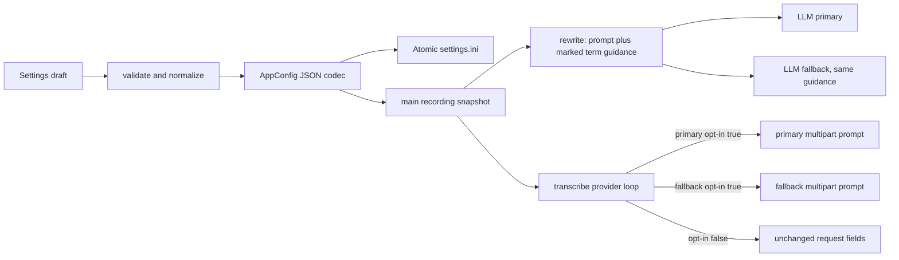

# 6. Custom Vocabulary / Personal Dictionary

> **Status:** planned, not shipped. This plan expands P2 from
> [FEATURES.md](../FEATURES.md#6-custom-vocabulary--personal-dictionary-p2).
> No vocabulary field or STT prompt support exists in the current config or
> request builder.

## Summary

Let users maintain preferred spellings and feed those terms as guidance to
rewrite, and optionally as an STT prompt for specifically opted-in providers.
Vocabulary is context, not a replacement table: it cannot guarantee exact
recognition or authorize translation/invention. Keep persistence/validation in
`config.py`, editing in the existing Settings dialog, and request shaping in
the existing `stt.py` / `rewrite.py` boundaries. STT and rewrite public
signatures remain unchanged.

## Start Here

- [`src/config.py`](../../src/config.py): `AppConfig`, explicit collection
  codec, `load_config`, `save_config`, `validate_config`.
- [`src/settings_dialog.py`](../../src/settings_dialog.py): STT/LLM tabs,
  `_populate`, `_collect`, `validate_config` integration, dialog draft.
- [`src/stt.py`](../../src/stt.py): `transcribe` provider loop and
  `_call_stt` multipart `data`; currently no prompt field.
- [`src/rewrite.py`](../../src/rewrite.py): `rewrite` common system prompt
  before primary/fallback loop and `_call_llm` request body.
- [`src/main.py`](../../src/main.py): captures the single per-session config
  used by both backends; must pass its vocabulary consistently.

## Proposed Data Contract

Persist preferred terms as one explicit JSON-encoded config field. A candidate
typed shape is:

```python
@dataclass
class AppConfig:
    vocabulary_entries: list[str] = field(default_factory=list)
    stt_prompt_primary_enabled: bool = False
    stt_prompt_fallback_enabled: bool = False
```

Suggested encoded INI example:

```ini
vocabulary_entries="[\"Screamer\",\"PySide6\",\"QThread\"]"
stt_prompt_primary_enabled=false
stt_prompt_fallback_enabled=false
```

Use explicit vocabulary codec functions in `config.py` (for example
`encode_vocabulary_entries(entries: list[str]) -> str` and
`decode_vocabulary_entries(value: object) -> list[str]`), not a generic
settings codec registry. Preserve user-entered display spelling, trim leading
and trailing whitespace, discard blank rows, and deduplicate by Unicode
casefold while preserving first occurrence/order. Never use entries as literal
find/replace pairs.

Keep prompt formatting local to the existing rewrite boundary; a proposed
helper contract is `format_vocabulary_context(entries: list[str]) -> str`,
returning `""` for no entries and a bounded, clearly marked instruction/list
otherwise. It must not mutate `entries`, include audio/transcript text, or
silently truncate. STT may use a distinct concise formatter if the provider
expects a shorter hint, but both derive from the same validated entry list.

`stt_prompt_primary_enabled` and `stt_prompt_fallback_enabled` are proposed
per-provider opt-ins. This is deliberately an explicit capability decision,
not inferred from URL, model name, `ProviderConfig.is_groq`, or an
OpenAI-compatible label. Defaults are false so existing providers receive
exactly their current request fields. A provider's enabled flag is the user's
affirmation that the configured endpoint accepts the supported multipart
`prompt` field; there is no capability discovery in source.

Suggested request-oriented engineering limits: 128 entries, 128 characters
per term, and at most 8,000 characters in the rendered context. These are
conservative defaults to bound settings and request size, not product
requirements or estimates of any provider's token limits. Validate entries and
rendered context at the config/Settings boundary; never silently truncate the
vocabulary sent to an endpoint. Review/adjust based on actual provider
contracts before implementation.

## How It Works

### Validation and migration

`load_config()` currently iterates dataclass fields and coerces only scalar
types. Add a dedicated decoder for the new JSON collection and treat an absent
key as the empty list. **Chosen corruption policy:** on malformed JSON, wrong
root shape or invalid entries, return a safe empty *effective* list, show a
specific Settings warning and retain the original serialized value in a
private config-sidecar field copied with Settings drafts. `save_config()` must
write that original value unchanged during unrelated tray/Settings saves. The
vocabulary editor offers explicit Reset/Replace damaged vocabulary confirmation;
only this user action clears the sidecar and permits the new encoded list to
replace the malformed source. Merely editing a different setting is not a
repair. This avoids lost user data without making the app unstartable or
blocking unrelated config saves. Keep the sidecar out of backend prompts and
history; never log its raw contents.

New Boolean opt-ins load absent as false. Old installs therefore make no
additional provider fields appear. Settings discards blank rows (including an
all-blank list) but flags over-limit or invalid nonblank terms and focuses the
appropriate tab. Keep supported
character policy broad: Unicode names/terms, punctuation, digits and
identifiers are valid; reject control characters and newline-separated
injection, since the system prompt is a single context. These exact limits and
character rules require engineering confirmation.

### Rewrite guidance

Build one effective prompt for each rewrite call by adding a clearly marked
context section with quoted/listed terms and an instruction that these are
preferred spellings only. The context does not modify the raw user transcript.
Preserve the user's configured system prompt and the conservative cleanup
constraints; the terms cannot weaken the no-answer/no-invention rule. Compose
the vocabulary context once before the existing primary/fallback loop so both
LLM attempts receive identical guidance. The selected session language hint
remains present through existing logic.

The default prompt can ship before vocabulary or profiles. When adding
prompt-context composition, do not replace the user's customized prompt. For
the default-prompt revision, recognize saved prompt state by actual persisted
key presence, not by comparing prompt text to the built-in default: a user may
have explicitly saved a byte-identical value. Vocabulary guidance should
compose with the prompt value selected in the session, including a future
custom profile prompt.

### Provider-specific STT prompt

Construct the current multipart fields (`model`, `response_format`, optional
`language`) as today. Add `prompt` only when the selected provider's own
`stt_prompt_*_enabled` is true and the rendered vocabulary is nonempty. A
provider with opt-in off receives exactly its existing request fields. The
fallback attempt must inspect fallback's flag, not inherit primary's setting.
An endpoint rejecting prompt can fail its request; the current `transcribe`
loop may then try configured fallback. Do not add an automatic retry of the
same provider without prompt: that changes request semantics and masks an
endpoint incompatibility.



### Errors and concurrency

Invalid UI values prevent Apply/OK; they must not partially update live
configuration. Atomic `save_config` already exposes persistence errors through
`ScreamerError(KEY_STORAGE_FAILED)`. A malformed provider custom-header value
is currently ignored inside backend request construction; vocabulary is
separate data and must not share or be smuggled through that header channel.
Provider request errors follow existing STT/LLM primary/fallback behavior.

At recording start main captures the one `deepcopy(AppConfig)` before later
tray changes and treats it read-only. This freezes vocabulary and the primary /
fallback opt-in pair for both backends. Do not have STT or rewrite take an
independent snapshot. Settings uses a draft copy and tray config-mutating
actions are disabled while its nested event loop is open (except Enable/Exit),
avoiding a lost update when Apply reloads/persists settings.

| Invariant / race | Owner and enforcement |
| --- | --- |
| Same spelling hints across fallback attempts, but provider STT opt-ins are independent. | `rewrite.py` composes once before LLM loop; `stt.py` chooses each provider's prompt flag at its own request. |
| Existing STT requests have no `prompt` by default. | Both flags default false and no URL/model heuristic can set them. |
| Vocabulary cannot silently become transcript/history text. | It is system-prompt context or optional STT multipart guidance, never edited into raw user message. |
| Editing while recording does not affect an in-flight request. | `main.py` passes its recording-start config snapshot; Settings is blocked while dictating. |
| Invalid saved terms are not quietly discarded and overwritten. | Collection decoder retains malformed raw value in a private sidecar; ordinary saves preserve it verbatim until explicit Reset/Replace. |

## Data Flow

1. Settings edits an ordered term list and per-STT-provider opt-in flags in its
   config draft; validation normalizes terms and checks engineering bounds.
2. Apply/OK encodes the list and saves all related fields through the existing
   atomic config path; Cancel discards the draft.
3. At dictation start main makes one config snapshot. A later edit affects the
   next dictation, not current STT or LLM requests.
4. `transcribe` builds a prompt field independently for each selected
   provider. If unsupported/opted out, that provider gets no new field.
5. `rewrite` builds marked spelling guidance into its effective system prompt;
   raw text remains the user message. Existing rewrite fallback and raw-text
   fallback behavior remain unchanged.

## Key Dependencies

- Feature 4's prompt fidelity rules apply: treat transcript as data; preserve
  intent, names, identifiers and language choices; do not answer, translate or
  invent. Vocabulary is a nudge, not exact substitution.
- Feature 1 language remains independently selectable and frozen with the same
  session config. No automatic code-switch language routing is added.
- Do not add provider capability catalog, plugin abstraction, new request
  service, public backend signature or generic framework.
- API-key and custom-header secret handling remain as currently defined; the
  vocabulary is ordinary local config, not a credential.

## Known Risks

- The original plan calls for per-provider "explicit capability opt-in" but
  does not name config fields or explain whether the opt-in means endpoint
  capability acknowledgement. Proposed Boolean names/defaults above make the
  design testable; product/engineering should confirm them.
- Prompt acceptance is endpoint-specific. This repository cannot prove that a
  given OpenAI-compatible server accepts `prompt`; configured opt-in is not
  auto-detection.
- A long term list increases request size and may dilute useful guidance.
  Proposed caps are engineering defaults requiring review against configured
  models/providers, not universal token guarantees.
- Future profile prompt selection and vocabulary composition need one shared
  ordering contract. Proposed order: selected profile/base system prompt,
  marked vocabulary guidance, then existing language hint; tests should assert
  invariants rather than brittle full prompt text.
- Current LLM DEBUG logging can include raw text snippets. Vocabulary must not
  be logged or copied into transcript/history; normal logs should continue to
  reveal neither terms nor prompt content.
- Nested Settings Qt event processing can otherwise allow a tray save between
  draft creation and Apply, losing that mutation. Use shared tray action
  disabling while Settings is open.

## Slices and Verification

1. Implement config fields/codecs and tests for JSON round-trip, missing key,
   malformed/wrong-root value, invalid element plus unrelated tray save
   preserving original raw bytes, explicit Reset/Replace, Unicode casefold
   dedupe, stable order, control rejection, length/count/context bounds, and
   atomic save failure policy.
2. Add Settings controls for adding/editing/removing entries and independent
   provider opt-ins. Test populate, duplicate normalization, invalid values,
   Apply persistence, Cancel isolation and a changed live config while dialog
   is open (the tray guard should prevent it).
3. Add LLM guidance construction. Test both provider attempts receive marked
   terms; disabled rewrite stays no-call; user prompt, language hint and raw
   transcript remain separate; failed/empty rewrite preserves current
   `LLM_FAILED` fallback and does not turn terms into replacements.
4. Add STT prompt per provider. Test omission by default, primary-only,
   fallback-only, both enabled, empty vocabulary, different primary/fallback
   flags, and existing language/response-format fields unaffected. Test an
   endpoint failure takes only existing fallback path.
5. Freeze config at session start; verify changing vocabulary/opt-in while
   processing affects only the next session. Keep `transcribe` and `rewrite`
   signatures unchanged.
6. Manual evaluation: Czech sentences with English technical terms, names,
   numbers and identifiers. Assess STT mistakes independently from rewrite
   changes; mocked payload tests are not evidence of quality.

## Sources

- [`docs/FEATURES.md`](../FEATURES.md#6-custom-vocabulary--personal-dictionary-p2):
  accepted entry types, provider-gated prompting and limits on claims.
- [`docs/IMPLEMENTATION-PLAN.md`](../IMPLEMENTATION-PLAN.md#6-custom-vocabulary--personal-dictionary-p2):
  first proposed flow; leaves schema, bounds and malformed persistence policy
  underspecified.
- [`src/config.py`](../../src/config.py): `AppConfig`, scalar-only loader,
  atomic save, prompt default and validation boundary.
- [`src/settings_dialog.py`](../../src/settings_dialog.py): current STT and
  LLM controls and copy/apply/cancel behavior.
- [`src/stt.py`](../../src/stt.py): current primary/fallback loop, multipart
  request fields and language propagation.
- [`src/rewrite.py`](../../src/rewrite.py): current prompt composition,
  primary/fallback behavior and raw-text warning fallback.
- [`src/main.py`](../../src/main.py): session snapshot integration point and
  current live config race.
- [`tests/test_config.py`](../../tests/test_config.py),
  [`tests/test_settings_dialog.py`](../../tests/test_settings_dialog.py),
  [`tests/test_stt_rewrite.py`](../../tests/test_stt_rewrite.py): current test
  boundaries for codecs, draft controls, and request payloads.
