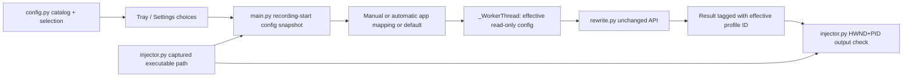

# 7. Simple Rewrite Profiles and App Matching

> **Status (2026-09-30):** code implemented; final automated checks and Windows app-matching acceptance remain pending. Current config, migration and runtime contracts are canonical in [IMPLEMENTATION.md](../IMPLEMENTATION.md). This detailed design expands P2 from
> [FEATURES.md](../FEATURES.md#7-simple-rewrite-profiles-and-app-matching-p2).
> The source now includes profile settings, migration, resolution and captured-executable matching; Windows identity behavior is not certified here.

## Summary

Replace overlapping global rewrite choices with a small set of built-in
`raw`/`clean` modes and editable user profiles that reuse the existing rewrite
pipeline. Optional app rules select a profile from the executable identity
captured when recording starts; a persistent manual selection overrides those
rules. The global AI Rewrite checkbox remains a hard off switch. The main
maintenance constraint is to resolve a profile once at recording start, then
freeze that effective choice with the same single `AppConfig` snapshot used by
language, vocabulary, output and provider settings. Do not create a second
configuration hierarchy or let foreground changes during processing change
which prompt is used.

## Start Here

- [`src/config.py`](../../src/config.py): global rewrite settings, `AppConfig`,
  load/save/validation and atomic INI path.
- [`src/main.py`](../../src/main.py): `_start_recording`, worker creation,
  tray menu, settings reload and result association; composition root.
- [`src/injector.py`](../../src/injector.py): future `WindowIdentity` and
  foreground target capture contract shared with output feature 2.
- [`src/rewrite.py`](../../src/rewrite.py): unchanged `rewrite(text, config)`
  consumes session `llm_enabled` and `llm_system_prompt`.
- [`src/settings_dialog.py`](../../src/settings_dialog.py): current LLM prompt
  editor and draft/apply/cancel patterns.

## Proposed Data Contract

Use a small explicit profile schema in `config.py`; no providers or credentials
belong inside profile records. One candidate codec-friendly representation is:

```python
@dataclass(frozen=True)
class RewriteProfile:
    id: str                  # stable ASCII slug/UUID; not derived from name
    name: str                # user-visible label
    kind: str                # "raw" | "clean" | "custom"
    prompt: str | None       # required only when kind == "custom"

@dataclass
class AppConfig:
    rewrite_catalog_json: str = '{"version":1,"profiles":[],"mappings":[]}'
    rewrite_default_profile_id: str = "clean"
    rewrite_selection_mode: str = "manual"  # "manual" | "automatic"
    rewrite_manual_profile_id: str = "clean"
```

Treat this as a proposed single encoded catalog for custom profiles **and** app
mappings, with scalar settings for the default/manual selection. Domain codecs
should own typed validation in `config.py`, e.g.
`decode_rewrite_catalog(value: object) -> tuple[list[RewriteProfile], list[AppMapping]]`
and `encode_rewrite_catalog(...) -> str`. Do not make a generic registry. Generate built-in `raw` and
`clean` records in code rather than permitting user edits to their stable IDs.
`clean` uses the current revised default prompt; `raw` is no LLM call. Custom
profile prompt edits remain user-authored data.

The main-owned resolver should have a narrow contract such as
`_resolve_effective_profile(config: AppConfig, target: WindowIdentity | None)
-> RewriteProfile`. It is deterministic for the supplied config and captured
target; it performs no OS query, persistence, UI mutation or global-state read.
Validate dangling IDs before resolution rather than falling back based on
mapping order. Before dispatch, main applies the chosen prompt/mode to the one
session config copy; no profile object is passed as a parallel configuration
tree into backends.

Suggested mapping record:

```json
[{"executable_path":"C:\\Program Files\\Editor\\editor.exe",
  "profile_id":"custom-..."}]
```

Normalize Windows paths for matching using absolute normalized full path and
case-insensitive comparison. Keep the stored/display path concrete; do not
match basenames. Reject duplicate normalized paths and references to deleted
or missing profiles. Proposed engineering limits (e.g. 32 custom profiles,
100-character display names, 32 KiB prompt) are not product requirements and
must be tuned/confirmed before implementation; enforce size limits before
serialization/request creation rather than truncate user-authored text.

### Selection semantics

1. If `llm_enabled` is false, effective execution is raw/no LLM regardless of
   selected profile. Preserve selected profile and prompts so re-enabling
   restores the previous choice.
2. If enabled and `rewrite_selection_mode == "manual"`, use
   `rewrite_manual_profile_id` even if an app mapping exists.
3. If enabled and mode is `"automatic"`, use a mapping for the captured
   executable path if present; otherwise `rewrite_default_profile_id`.
4. `raw` suppresses the LLM call. `clean` uses the revised conservative
   default. `custom` sends its own prompt through the existing `rewrite()`.

The tray/profile UI must make selection mode and the configured choice
visible. `Automatic` is an explicit persistent choice, not a temporary
one-dictation override. Language is not profile-scoped.

## How It Works



### Legacy settings migration

The existing config has `llm_enabled` (default false), `llm_system_prompt` (the
current editable prompt), and persisted `llm_prompt_origin`, as documented in
[IMPLEMENTATION.md](../IMPLEMENTATION.md#configpy). `save_config()` persists even
an untouched new default. A text comparison cannot distinguish an untouched old
prompt from a deliberately saved prompt equal to the old default. For older INIs
without provenance, migration uses actual persisted-key presence; otherwise use
the explicit provenance marker.

| Prior persisted state | Migration result |
| --- | --- |
| Origin absent, old `llm_system_prompt` key exists | Preserve exact prompt as an editable `custom` legacy profile and select it manually, even if byte-identical to old or new built-in text |
| Origin absent, prompt key absent | Select revised built-in `clean` as default/manual choice |
| Origin `legacy_saved` or `user_saved` | Preserve exact saved prompt as an editable `custom` profile and select it manually |
| Origin `default_v2` | Select built-in `clean`, retaining global `llm_enabled` state; prompt must match recorded default revision or require repair |
| `llm_enabled` false | Keep global rewrite disabled; preserve prompt/profile selection for later re-enable |
| `llm_enabled` true | Keep rewrite enabled and select migrated legacy prompt so behavior is not silently replaced |
| Profile catalog exists but malformed/invalid | Fail validation or retain source and require explicit repair; never silently replace profiles/mappings with empty values |

Important coupling: current `save_config` persists dataclass fields but does not
preserve a deleted unknown value if migration has not decoded it. Implement
migration before ordinary save and write old prompt plus new profile state
atomically. For INIs without provenance, use
`settings.contains("llm_system_prompt")` at the migration boundary. The existing
`DEFAULT_LLM_SYSTEM_PROMPT` supplies clean mode and must not implicitly set
`llm_enabled=True` for new installs. Preserve the marker
or a profile-schema version so repeat loads do not duplicate the legacy profile.

### App matching and capture

At recording start, capture the target using the shared planned API from
`injector.py`:

```python
@dataclass(frozen=True)
class WindowIdentity:
    hwnd: int
    process_id: int
    executable_path: str | None

def get_foreground_target() -> WindowIdentity | None: ...
```

`hwnd` plus PID are for output target checks; normalized full path alone is
used for app profile matching. A missing executable path falls back to the
configured default in automatic mode. It must not prevent output to an
otherwise verified HWND, nor cause a second query at worker completion.
Capture on the Qt/main thread before Screamer UI can change foreground. Do not
read window title, UI text, selection, clipboard, or add a process registry.

At `_start_recording`, create one `deepcopy(self._config)` before any later
tray mutation, then resolve the profile from that copied config and the
captured target. The main-private `_Session` stores that same snapshot,
`WindowIdentity | None`, and session ID. Prepare its effective rewrite fields
before treating the snapshot as read-only; `_WorkerThread` receives the
snapshot, not a separate profile config object. A practical adapter preserves
backend signatures: set session `llm_enabled=False` for `raw`; otherwise set
effective profile prompt in session `llm_system_prompt` while leaving global
`llm_enabled` respected. Do not mutate after worker starts.

### Main and worker boundaries

`rewrite(text, config)` already short-circuits when `config.llm_enabled` is
false and otherwise reads `llm_system_prompt` plus `stt_language`. No `stt.py`
or `rewrite.py` import of profiles is needed. Future Feature 3's
`DictationRecord` should capture `profile_id` (including built-in `raw`/
`clean`) beside language and target executable, and derive `final_text` from
raw/rewritten state. `PipelineResult` and backend signatures remain unchanged.

The worker emits a planned `raw_ready(PipelineResult)` after successful STT;
main is the sole mutable result owner. The session/profile identity must remain
associated with that result even if the user changes tray selection while
processing. The single worker busy gate remains held until `QThread.finished`;
no queue or parallel dictations.

```mermaid
sequenceDiagram
    actor User
    participant Main as main.py
    participant Injector as injector.py
    participant Worker as _WorkerThread
    participant Rewrite as rewrite.py
    User->>Main: begin dictation
    Main->>Main: deepcopy live AppConfig once
    Main->>Injector: get_foreground_target()
    Injector-->>Main: HWND, PID, optional executable path
    Main->>Main: resolve manual / app mapping / default
    Main->>Main: freeze same session config and profile ID
    Main->>Worker: WAV + session config
    Worker->>Rewrite: rewrite(raw, same config)
    User->>Main: change profile or foreground app
    Main->>Main: live config only; session unchanged
    Rewrite-->>Worker: PipelineResult
    Worker-->>Main: final result; retain original session profile ID
```

## Data Flow

1. On load, migrate legacy prompt with key-presence semantics and decode
   profile/mapping JSON with validation; retain disabled state independently.
2. Settings edits profiles, default, persistent manual/automatic selection and
   optional path mappings on a draft. Apply/OK validate and save atomically;
   Cancel discards changes.
3. Tray can select a profile or `Automatic`. Manual choice remains until
   explicitly changed to Automatic; selected mode and choice remain visible.
4. Recording start makes one AppConfig copy, captures the foreground identity,
   resolves the effective profile, and finalizes that same copy before worker
   dispatch. App/process focus changes later do not re-resolve.
5. Worker keeps existing STT/rewrite signatures. Raw suppresses LLM; clean or
   custom sends a profile prompt using existing primary/fallback behavior.
6. Result/history stores the effective profile ID, not whichever profile is
   selected after completion. Output safety still checks captured HWND/PID;
    app match never bypasses output-target checks.

| Invariant / race | Owner and enforcement |
| --- | --- |
| Manual selection beats app mapping; global off beats all rewriting. | Main resolver follows fixed precedence at recording start, never at worker completion. |
| One path maps to at most one profile and all referenced IDs exist. | Config catalog decoder and Settings validation reject duplicate normalized paths/dangling IDs. |
| Legacy saved prompt is not replaced by revised `clean`, even when equal to prior default. | Config migration uses key presence and persists custom legacy choice atomically. |
| Changing app focus or tray profile while processing cannot retarget prompt or output. | Main-owned config/target snapshot; separate executable-path match vs HWND/PID output guard. |
| Custom raw mode never calls LLM. | Resolved session config disables rewrite while preserving live global selection for later sessions. |

## Key Dependencies

- Feature 1's language remains an independent tray choice and uses the same
  session snapshot. No per-app language rules.
- Feature 2 supplies `WindowIdentity` and target validation. App matching uses
  `executable_path`; output uses exact HWND + PID. These are related captures,
  not interchangeable identifiers.
- Feature 3 supplies `DictationRecord` and in-memory recovery. Proposed fields
  include `profile_id`; recovery rerun from raw must use the profile chosen by
  the explicit rerun action or clearly record the new profile, not silently
  overwrite the original dictation's identity.
- Reuse the existing conservative clean prompt and preserve authored prompts
  according to [IMPLEMENTATION.md](../IMPLEMENTATION.md#configpy). Prompt fidelity
  is a best-effort contract, not semantic guarantee.
- Existing `llm_enabled` quick toggle stays a global off switch. Providers,
  credentials, language and output settings remain global.
- Settings is modal but has a nested event loop. Disable config-mutating tray
  callbacks while it is open (Enable and Exit remain usable), or tray updates
  can race the draft and be overwritten by Apply. Reload/rebuild remains
  `main.py`'s responsibility after dialog completion.

## Known Risks

- The original plan's phrase "preserve any saved prompt" requires checking
  persisted key presence, not only the value of `AppConfig.llm_system_prompt`,
  which always has a default. This is a migration correctness condition.
- Whether an old enabled user should automatically use their preserved legacy
  prompt as a manual profile, rather than revised clean, is an important
  migration choice. The plan's stated intent to preserve current behavior
  supports legacy prompt selection; verify against actual old config versions
  before coding.
- The initial Feature 7 plan says freeze the prompt/mode with the session but
  does not define how `raw` reaches an unchanged `rewrite()` signature. Setting
  the session copy's `llm_enabled=False` resolves that without a new config
  type or backend branch.
- Full path match distinguishes same-basename applications but moves/upgrades
  require remapping. Windows path normalization, reparse points, inaccessible
  executable metadata and PID reuse require boundary tests; no source proves a
  stable path can always be queried.
- Duplicate app paths and dangling profile IDs need fail-closed validation.
  Never make array order an undocumented precedence rule.
- A user changing tray profile during worker execution must not alter session
  config or result profile ID. Settings remains unavailable during active
  dictation under current `_open_settings` guard; profile tray actions still
  need snapshot isolation.
- Manual selection persistence across restart and an Automatic mode are
  proposals from the original plan; product scope does require manual override
  over app match but does not prescribe persistence duration. Confirm before
  locking public config semantics.

## Slices and Verification

1. Define profile/mapping types, explicit JSON codecs, IDs, validation and
   migration. Test built-in immutability, valid custom entries, invalid IDs or
   kinds, duplicate IDs, dangling mappings, duplicate normalized paths,
   malformed JSON and atomic persistence.
2. Test migration with key absent, key present with old prompt, key present
   byte-identical to old default, `default_v2` after an ordinary Settings save,
   edited `user_saved`, LLM enabled/disabled and failure during first migrated
   save. Assert no install turns rewriting on implicitly, no existing prompt is
   lost, and repeat startup does not create a second legacy profile.
3. Add Settings profile CRUD, mapping and manual/automatic controls. Test
   Apply/Cancel and global quick-toggle retention. Validate path display and
   duplicate path rejection without needing a live process.
4. Add tray profile choice and selection visibility. Test manual-over-app,
   automatic app match, default fallback, missing path, missing mapping and
   global rewrite disabled.
5. Test `_start_recording` captures one config before recording, passes same
   session config to worker, resolves once against captured executable, and
   ignores later selection/focus changes. Assert raw sends no LLM request;
   clean/custom use the selected prompt in primary and fallback; language and
   vocabulary still come from the same snapshot.
6. Test `profile_id` on result is the effective session choice and is not
   rewritten by later tray selection. Test foreground change cannot change
   profile or bypass exact output target checks.
7. Windows manual: two applications with distinct paths, duplicate basenames,
   changed focus while processing, unavailable executable path, moved app
   remapping, and manual override. Mocks cannot prove real Windows identity
   retrieval or safe delivery.

## Sources

- [`docs/FEATURES.md`](../FEATURES.md#7-simple-rewrite-profiles-and-app-matching-p2):
  raw/clean/custom, app matching, manual override and no-context boundaries.
- [`docs/IMPLEMENTATION-PLAN.md`](../IMPLEMENTATION-PLAN.md#7-simple-rewrite-profiles-and-app-matching-p2):
  first profile/migration proposal; leaves persistence schema and raw-mode
  backend adaptation implicit.
- [`src/config.py`](../../src/config.py): current global `llm_enabled` and
  prompt defaults, dataclass persistence, QSettings key-presence access.
- [`src/settings_dialog.py`](../../src/settings_dialog.py): current prompt
  editing, config draft, validation and Apply/Cancel.
- [`src/rewrite.py`](../../src/rewrite.py): unchanged backend behavior,
  disabled short-circuit, prompt/language composition and fallbacks.
- [`src/main.py`](../../src/main.py): tray rewrite toggle, recording start,
  worker lifecycle, current mutable-config handoff and Settings reload.
- [`docs/implementation-plan/01-language.md`](01-language.md): session
  snapshot and independent language-choice plan.
- [`docs/implementation-plan/06-vocabulary.md`](06-vocabulary.md): vocabulary
  prompt composition and the shared session config boundary.
- [`tests/test_config.py`](../../tests/test_config.py),
  [`tests/test_settings_dialog.py`](../../tests/test_settings_dialog.py),
  [`tests/test_tray_menu.py`](../../tests/test_tray_menu.py),
  [`tests/test_stt_rewrite.py`](../../tests/test_stt_rewrite.py): current
  persistence/UI/tray/request test boundaries.
