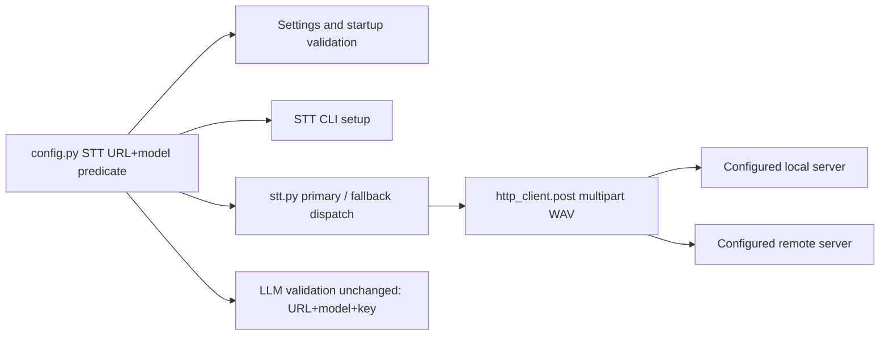

# Feature 8: Local STT Server Support

## Summary

This feature lets the existing OpenAI-compatible STT path call a local server without requiring an API key. It is an STT-only configuration and validation change: retain manual endpoint/model fields, multipart request behavior, existing authenticated cloud providers, and optional fallback. Candidate local servers are not certified by their product names; compatibility must be verified against an exact version/configuration before publishing a preset or claiming support.

## Start Here

- `src/config.py`: shared `ProviderConfig.is_complete`, `AppConfig` provider construction, validation, serialization and `.env` mapping.
- `src/stt.py`: primary/fallback selection, endpoint construction, auth, multipart fields and response parsing.
- `src/settings_dialog.py`: primary/fallback endpoint controls and current STT-only UI.
- `src/main.py`: actual interactive caller via `_WorkerThread` and `transcribe()`.
- `docs/FEATURES.md`: local/no-key requirement and offline acceptance gate.

## Current-Source Audit

- `ProviderConfig.is_complete` currently requires key + base URL + model for all providers (`config.py:228-245`). Do not loosen it globally: LLM behavior and `rewrite._call_llm()` depend on authenticated completeness.
- `AppConfig.stt_provider()` and `stt_fallback_provider()` produce generic `ProviderConfig` instances. Fallback enabled state is independent; existing `.env` variables backfill empty fields (`config.py:299-316,724-749`).
- `validate_config()` requires key for primary/fallback STT, including requiring a configured primary or enabled complete fallback (`config.py:646-659`). The Settings dialog reports validation results before saving (`settings_dialog.py:695+`).
- `transcribe(audio_wav, config)` uses primary then enabled fallback, passing the configured language for each. `_call_stt()` currently returns `None` without a key, builds `base_url.rstrip('/') + '/audio/transcriptions'`, sends Bearer auth, model + response format + optional language, and accepts a JSON object whose `text` field is non-empty (`stt.py:19-65,68-131`).
- Groq host detection alone switches `response_format` from `verbose_json` to `json`. For other providers, a non-empty `segments` list is rejected only if all `no_speech_prob` values are at/above 0.7. Missing segments do not block non-empty text (`stt.py:77-88,116-128`).
- `parse_custom_headers()` values are applied with `httpx.Headers.update()`. Header names are case-insensitive; custom `Authorization` replaces the generated Bearer value without duplicate auth (`stt.py:80-85`; `tests/test_stt_rewrite.py:77-95`). When no key is configured, retain custom headers including alternative auth, but do not synthesize auth or copy primary credentials to fallback.
- STT CLI loads config and `.env`, but currently exits early solely when `cfg.stt_api_key` is empty (`stt.py:138-160`). It must use the same STT-specific URL/model completeness rule as validation and dispatch.
- The manual Settings endpoint fields exist for both providers (`settings_dialog.py:303-333`); current UI should clarify that an empty STT API key is supported for a server that needs none. LLM fields/help remain unchanged.
- `_WorkerThread` calls `transcribe()` and then `rewrite()`; local STT alone does not change LLM provider routing (`main.py:57-104`). Feature 8 must not imply that enabled LLM cleanup or STT fallback is local.

## How It Works



### Types and compatibility boundary

Preserve `ProviderConfig` and its `is_complete` meaning. Introduce an STT-specific predicate, preferably a narrow helper such as `stt_provider_is_configured(provider: ProviderConfig) -> bool`, meaning `bool(provider.base_url and provider.model)`; a separate STT value type is not necessary unless implementation finds a real need. Use the identical predicate for primary/fallback validation, STT dispatch selection, and CLI setup detection. LLM validation and `rewrite._call_llm()` continue requiring API key + URL + model.

The public API remains:

```python
def transcribe(audio_wav: bytes, config: AppConfig) -> PipelineResult: ...
```

`_call_stt(provider: ProviderConfig, language: str, audio_wav: bytes) -> str | None` may remain private and retain its inputs. Don't add local-provider enums/catalog, discovery, model download, key sharing, retry queues, endpoint restrictions or networking policy.

### Request construction and endpoint semantics

The URL entered in Settings/config is the base URL. Code appends exactly `/audio/transcriptions` after trimming trailing `/` characters. It does not discover routes, normalize `/v1`, remove an already-present `/audio/transcriptions`, or adapt OpenAI-compatible variants. Document examples only after checking that the chosen exact server configuration expects that resulting route.

Multipart request shape currently sent:

| Field | Current rule |
|---|---|
| URL | `provider.base_url.rstrip("/") + "/audio/transcriptions"` |
| `file` | tuple `("recording.wav", audio_wav, "audio/wav")` |
| `model` | `provider.model` |
| `response_format` | `json` when `ProviderConfig.is_groq`; otherwise `verbose_json` |
| `language` | included only if `config.stt_language` is non-empty, for primary and fallback |
| Auth | Default `Authorization: Bearer <api_key>` only if key exists; custom headers updated afterward and override same-named defaults |
| Timeout | 60 seconds through `http_client.post()` |

The response parser expects JSON with a string-like `text` value; it strips whitespace and raises `NO_SPEECH` for empty output. Non-Groq segment confidence filtering applies as described in the audit. Do not claim that an engine is supported merely because its name suggests Whisper or OpenAI compatibility: route, accepted multipart fields, auth behavior, response format/schema, language and optional prompt support are version/configuration-specific.

### Sequence

```mermaid
sequenceDiagram
    participant UI as Settings / CLI / tray setup
    participant C as config validation
    participant M as main._TrayApp
    participant W as _WorkerThread
    participant S as stt.transcribe
    participant H as http_client
    participant L as local or remote STT server
    UI->>C: base_url + model + optional key
    C->>C: STT configured iff URL and model exist
    M->>W: audio + one deepcopy(AppConfig) at recording start
    W->>S: transcribe(audio_wav, snapshot)
    S->>S: choose configured primary; otherwise enabled fallback
    S->>H: POST appended route, multipart WAV, optional auth/language
    H->>L: synchronous request, 60s timeout
    L-->>H: JSON response
    H-->>S: response
    S->>S: status check, parse text, no-speech filter
    alt primary request fails and enabled fallback is configured
        S->>H: independently configured fallback request
    end
    S-->>W: PipelineResult(text, warnings)
    W->>W: cancellation check, rewrite step remains independently configured
```

### Function and call-site responsibilities

| Site | Planned responsibility |
|---|---|
| STT-specific predicate in `config.py` | Define completeness as URL + model. Keep `ProviderConfig.is_complete` unchanged. |
| `validate_config(cfg)` | Allow blank key for URL/model-complete primary or enabled fallback; still reject partial URL/model setup and require at least one valid configured STT path. Keep keyless LLM invalid. |
| `SettingsDialog._build_stt_tab()` | Clarify API key may be blank for a server that does not require authentication. Preserve manual URL/model/headers fields, fallback control, copied config and Apply/Cancel behavior. No preset required. |
| `SettingsDialog._populate()` / `_collect()` | Round-trip empty key, URL, model, headers, language and fallback separately without filling a key from another provider. |
| `transcribe(audio_wav, config)` | Select primary only when STT-specific completeness is true; then enabled configured fallback as today. Preserve language, warning and error contract. |
| `_call_stt(provider, language, audio_wav)` | Omit default Authorization iff key is empty; always merge valid configured custom headers after defaults. Preserve appended route, fields, response parsing and timeout. |
| STT CLI `__main__` | Use the same completeness predicate after `load_config()` and `.env` backfill. Keyless URL/model config proceeds to WAV read and transcription. |
| LLM `rewrite()` and `validate_config()` LLM branch | No change: LLM still requires key + URL + model and uses its own endpoint/auth. |
| `main._finalize_recording()` / `_WorkerThread` | Continue through unchanged `transcribe(bytes, AppConfig)` public contract using one read-only start snapshot. No local-specific worker or background pool. |

### Primary, fallback and CLI precedence

| Primary | Fallback enabled + configured | Behavior |
|---|---|---|
| URL + model + key | Any | Primary attempted first with Bearer key. Fallback only follows according to existing STT failure/no-text loop, preserving its own key/headers. |
| URL + model, blank key | No | Keyless primary attempted; no default Authorization header; custom headers remain. |
| Absent primary | Enabled, URL + model, blank key | Keyless fallback is a valid sole provider and is attempted. |
| Partial primary (URL or model only) | Even if fallback configured | Settings/startup validation reject this active incomplete primary; direct `transcribe()` skips it and may try a configured fallback, but that is not permission to save the invalid config. |
| URL + model, blank key | Enabled + configured fallback | Primary first, fallback only when current fallback semantics permit; no auth copied between them. |
| Both absent/partial | Any incomplete path | Validation rejects; direct `transcribe()` reports `STT_FAILED` rather than attempting an empty provider. |
| STT key blank, LLM enabled with no LLM key | STT may be valid; LLM invalid | Local STT does not make keyless LLM complete. Disable rewrite for local-only dictation unless separately configured. |

Preserve current special case: `NO_SPEECH` from primary is final and does not trigger fallback (`stt.py:52-55`). Transport/status/parse exceptions and no usable text follow existing fallback rules; do not broaden fallback behavior as part of keyless support without separately documenting the changed contract.

| Invariant / race | Owner and enforcement |
| --- | --- |
| STT readiness means URL + model, with or without a key, in every caller. | Shared STT-specific config predicate used by validation, dispatch and CLI. |
| LLM remains key-required. | Existing `ProviderConfig.is_complete` and LLM validation are unchanged. |
| Empty key produces no default Bearer header; custom auth remains effective. | `stt._call_stt` builds provider-local headers before each request. |
| Fallback must never borrow primary auth, prompt capability or language from mutable live UI. | Same recording-start config snapshot; provider-local settings on each attempt. |
| A late HTTP result after disable cannot insert text. | Main's existing cancellation guard and feature 3 terminal/result lifecycle, not a transport-specific timer. |

## Data Flow

1. User or `.env` provides STT base URL and model; API key can remain empty. Primary and fallback are independent.
2. Settings validation, startup validation, STT selection and CLI check the same STT-only URL/model predicate. Shared `ProviderConfig.is_complete` stays key-required for LLMs.
3. At recording start, main captures one `deepcopy(AppConfig)`; worker reads it throughout `transcribe()` and subsequent rewrite. Mutable UI and result state remain on Qt main thread.
4. `transcribe()` uses configured primary first and then existing enabled fallback handling. `_call_stt()` appends `/audio/transcriptions`, sends multipart WAV and provider-local headers. Language is sent if configured.
5. HTTP transport posts synchronously; parser checks status, reads JSON `text`, applies current no-speech logic and returns `PipelineResult` or raises `ScreamerError`.
6. Worker proceeds to rewrite if configured. Offline acceptance requires rewrite disabled and cloud fallback disabled; selecting a local primary alone is not an offline/privacy guarantee.

## Local Server Verification Protocol

Candidates such as `faster-whisper-server` and particular `whisper.cpp` server configurations are **UNVERIFIED** until a maintainer completes and records this protocol against a pinned version/configuration. No tested compatibility claim or working preset is asserted by this plan.

1. Select one candidate and record project/repository, exact release or commit, runtime configuration, OS, model identifier and launch command from that version's own docs/source. Do not generalize to all versions.
2. Inspect its server route and mount/base-path semantics. Compute the exact Screamer base URL such that appending `/audio/transcriptions` reaches that route; do not silently include an assumed `/v1`.
3. Check multipart field names and supported values for `file`, `model`, `response_format`, optional `language`, and optional prompt. Determine whether unknown fields are ignored/rejected. Record auth requirements and response status/content type/schema.
4. Start it locally with a small known WAV. With Screamer's exact multipart request, verify non-empty `text`, empty/no-speech response, and HTTP error behavior. Record whether `verbose_json` is accepted; if not, provider classification/request shaping needs an explicit narrow design rather than a project-name exception.
5. Run a second request with no API key and verify there is no Authorization header; separately add a custom header and verify it is transmitted. Confirm primary/fallback never shares keys.
6. After code implementation, run a real Windows dictation with the pinned server, networking unavailable, rewrite disabled, and cloud STT fallback off. Record raw transcript and observable outcome without claiming transcription quality beyond that test.
7. Only then add an example/preset to maintained docs: pin server/version/configuration, state exact base URL/model/key settings and launch requirements, describe known unsupported fields, and make no claim beyond verified behavior.

Acceptance record to complete at implementation time:

| Field | Required evidence |
|---|---|
| Server / version / commit | Exact pin; `UNVERIFIED` until filled. |
| Runtime / OS / model | Actual tested values, not an assumed compatibility matrix. |
| Route and Screamer base URL | Observed route and calculated appended URL. |
| Multipart fields / response | Captured or server-documented support and actual parsed `text`. |
| Keyless/custom auth | Request observation for absent key and custom header. |
| Offline Windows dictation | Networking disabled, rewrite off, fallback off; actual result recorded. |
| Outcome and known limits | Pass/fail plus exact reason; no broader inference. |

## Failure and Migration

- Existing cloud config remains complete because its key, URL and model are unchanged. Existing custom auth headers still override generated Bearer auth case-insensitively.
- Blank-key local config becomes a valid STT configuration only with both URL and model. A URL-only or model-only partial remains invalid. Enabled fallback still requires URL and model; its key may be blank.
- Preserve INI fields and `.env` backfill names. Empty persisted fields may still be backfilled from `.env`; do not rewrite values, migrate endpoint strings, or infer provider type from hostnames.
- If custom headers are malformed, Settings validation remains the guard. If `_call_stt` is called directly despite invalid configuration, current behavior logs invalid custom headers and ignores them; do not turn keyless support into implicit permissive auth parsing.
- HTTP/status/JSON/network errors remain mapped through existing `ScreamerError` and fallback rules. Local server failure must not silently switch to cloud unless an explicitly enabled and configured fallback exists.
- Feature 6 prompt support uses separate per-provider opt-ins and is not implied by this feature. The planned `stt_prompt_primary_enabled` and `stt_prompt_fallback_enabled` flags remain independent; unsupported prompt fields must not be sent by default.

## Regression Tests and Gates

Extend `tests/test_config.py`, `tests/test_stt_rewrite.py`, and `tests/test_settings_dialog.py`. Add CLI coverage using the existing module-smoke entry path with patched config and file/request boundaries; tests do not certify an external server.

| Test | Input / setup | Expected observable effect |
|---|---|---|
| Keyless primary validation | `AppConfig(stt_api_key="", stt_base_url="http://127.0.0.1:5000/v1", stt_model="whisper")` | STT config has no validation issue when other required settings are valid. |
| Partial provider validation | URL without model; model without URL; enabled fallback with partial fields | Each incomplete active configuration is rejected with STT-tab issue; key absence alone is not the error. |
| LLM boundary | `llm_enabled=True`, keyless LLM with URL/model, valid keyless STT | LLM completeness issue remains; `ProviderConfig.is_complete` semantics unchanged. |
| Keyless request | Keyless primary, fake response `{"text":"hello"}` | Request URL ends `/audio/transcriptions`; no `authorization`; multipart has filename/content type, model, expected response format; returns `hello`. |
| Header precedence | Key + custom lower/mixed-case Authorization | Exactly one custom auth header; without key, custom Authorization still passes; no primary auth copied to fallback. |
| Authenticated cloud regression | Existing key/base/model + custom non-auth header | Bearer auth and custom header remain; multipart/endpoint behavior unchanged. |
| Keyless fallback | Absent primary, enabled complete-by-URL/model fallback with blank key | Fallback called once at its appended route; no auth; returns fallback text plus `STT_FALLBACK_USED`. |
| Primary/fallback precedence | Both configured, primary transport failure | Calls primary before fallback; each uses independent URL, model, key, custom headers and language. |
| Response parsing | Non-Groq `verbose_json`, valid segment + text; empty text; segments all >= 0.7 | Correct text accepted; empty/all-silent response raises `NO_SPEECH`; no false claim that missing segment metadata is mandatory. |
| CLI keyless setup | `.env`/loaded config has blank key but URL + model and valid WAV | CLI reaches `transcribe()` rather than printing missing-key setup message; missing WAV remains file error. |
| Settings round-trip | Blank key with URL/model, custom headers, fallback and Cancel | Apply persists valid values; Cancel does not mutate source; key remains blank. |
| No unintended cloud route | Local primary fails with fallback disabled | Failure surfaces through existing error path; no second URL/request. |

Windows/manual acceptance is separate from mocked request tests: use a pinned verified server, disable all external networking, configure blank key, disable rewrite and cloud fallback, dictate into a target, and record server/version/config/result. Run existing compile/import/regression and packaging checks as part of the implementation release gate; this docs-only plan does not claim they have run.

## Key Dependencies

- `httpx` multipart requests and `src.http_client.post()` / `raise_for_status()` shared synchronous transport.
- `AppConfig`, `ProviderConfig`, `FallbackProviderConfig`, QSettings persistence, `.env` backfill and `validate_config()`.
- STT Settings tab, STT CLI, tray composition root and `_WorkerThread`; all must use the same completeness definition and existing public transcribe API.
- Feature 6 per-provider optional prompt flags, if integrated: do not infer capability from local provider type or send unsupported fields by default.
- Shared runtime contract: one config `deepcopy` on recording start; worker config is read-only; mutable result/UI state stays on main thread; busy until QThread `finished`; no background pool.

## Known Risks

- OpenAI-compatible labels do not prove exact endpoint route, multipart field support, response schema, language support or auth behavior. Candidate integrations remain unverified until the acceptance record is filled from version-pinned evidence.
- The current base URL append behavior can double-append a route when users enter a full route. This is current behavior, not endpoint normalization; documentation and Settings help must call out base-URL expectations.
- `is_groq` changes `response_format` by hostname; a local server may reject `verbose_json`. Do not fix through guessed URL detection; either verify support or design explicit provider capability only with evidence.
- Local STT does not ensure no network traffic while cloud fallback or LLM rewrite is enabled. This feature does not add enforced local-only mode.
- A keyless `http://` endpoint may expose traffic on an untrusted network. Locality is configured by the user; no allowlist, TLS policy or privacy firewall is in scope.

## Sources

- `docs/FEATURES.md`: section 8 keyless requirement, configurable endpoint, offline acceptance and explicit non-guarantee.
- `docs/IMPLEMENTATION-PLAN.md`: original section 8 proposal and final integration gate.
- `src/config.py`: provider completeness, AppConfig provider factories, validation and `.env` import mappings.
- `src/stt.py`: actual primary/fallback, endpoint, auth, fields, timeout and response parser.
- `src/http_client.py`: shared post/error boundary and safe status reporting.
- `src/settings_dialog.py`: STT endpoint fields, copy semantics and validation/save flow.
- `src/main.py`: interactive caller and worker pipeline.
- `tests/test_stt_rewrite.py`: request, auth override, fallback, Groq/non-Groq and error test conventions.
